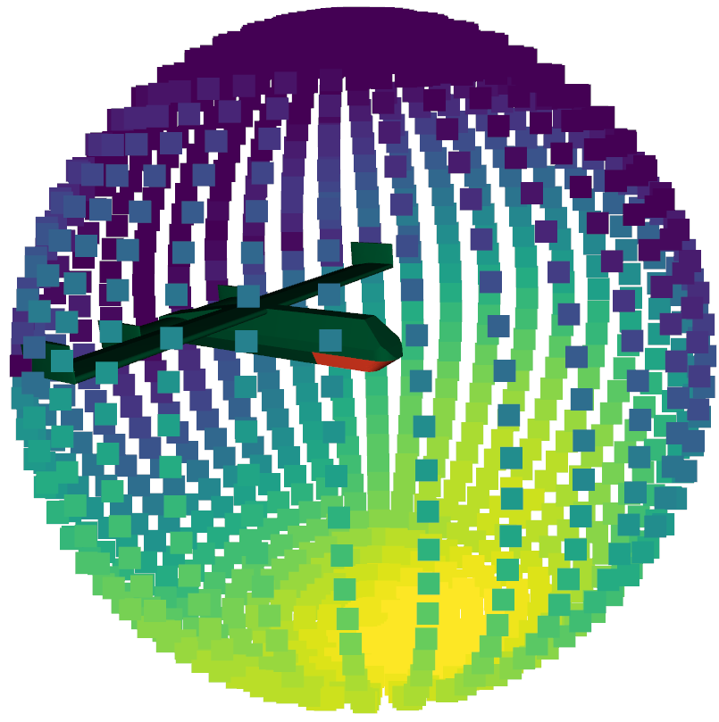

.. DO NOT EDIT.
.. THIS FILE WAS AUTOMATICALLY GENERATED BY SPHINX-GALLERY.
.. TO MAKE CHANGES, EDIT THE SOURCE PYTHON FILE:
.. "auto_examples\01_aperture_projection.py"
.. LINE NUMBERS ARE GIVEN BELOW.

.. only:: html

    .. note::
        :class: sphx-glr-download-link-note

        Click :ref:`here <sphx_glr_download_auto_examples_01_aperture_projection.py>`
        to download the full example code

.. rst-class:: sphx-glr-example-title

.. _sphx_glr_auto_examples_01_aperture_projection.py:

Calculating Antenna Array Performance Envelope using Aperture Projection
==========================================================================
This is a demonstration using the aperture projection function in the context of a conformal antenna array mounted upon
an unmanned aerial vehicle.

Aperture Projection as a technique is based upon Hannan's formulation of the gain of an aperture based upon its surface
area and the freuqency of interest. This is defined in terms of the maximum gain :math:`G_{max}`, the effective area of
the aperture :math:`A_{e}`, and the wavelength of interest :math:`\lambda`.

.. math::
    G_{max}=\dfrac{4 \pi A_{e}}{\lambda^{2}}

While this has been in common use since the 70s, as a formula it is limited to planar surfaces, and only providing the
maximum gain in the boresight direction for that surface.

Aperture projection as a function is based upon the rectilinear projection of the aperture into the farfield. This can
then be used with Hannan's formula to predict the maximum achievable directivity for all farfield directions of
interest.

As this method is built into a raytracing environment, the maximum performance for an aperture on any platform can also
be predicted using the :func:`lyceanem.models.frequency_domain.aperture_projection` function.

.. GENERATED FROM PYTHON SOURCE LINES 28-33

.. code-block:: default

    import numpy as np
    import open3d as o3d
    import copy

.. GENERATED FROM PYTHON SOURCE LINES 34-43

Setting Farfield Resolution and Wavelength
-------------------------------------------
LyceanEM uses Elevation and Azimuth to record spherical coordinates, ranging from -180 to 180 degrees in azimuth,
and from -90 to 90 degrees in elevation. In order to launch the aperture projection function, the resolution in
both azimuth and elevation is requried.
In order to ensure a fast example, 37 points have been used here for both, giving a total of 1369 farfield points.

The wavelength of interest is also an important variable for antenna array analysis, so we set it now for 10GHz,
an X band aperture.

.. GENERATED FROM PYTHON SOURCE LINES 43-48

.. code-block:: default

    az_res = 37
    elev_res = 37
    wavelength = 3e8 / 10e9

.. GENERATED FROM PYTHON SOURCE LINES 49-53

Geometries
------------------------
In order to make things easy to start, an example geometry has been included within LyceanEM for a UAV, and the
open3d trianglemesh structures can be accessed by importing the data subpackage

.. GENERATED FROM PYTHON SOURCE LINES 53-60

.. code-block:: default

    import lyceanem.tests.reflectordata as data

    body, array, _ = data.exampleUAV(10e9)

    # visualise UAV and Array
    o3d.visualization.draw_geometries([body, array])

.. GENERATED FROM PYTHON SOURCE LINES 61-62

# .. image:: ../_static/open3d_structure.png

.. GENERATED FROM PYTHON SOURCE LINES 62-73

.. code-block:: default

    # crop the inner surface of the array trianglemesh (not strictly required, as the UAV main body provides blocking to
    # the hidden surfaces, but correctly an aperture will only have an outer face.
    surface_array = copy.deepcopy(array)
    surface_array.triangles = o3d.utility.Vector3iVector(
        np.asarray(array.triangles)[: len(array.triangles) // 2, :]
    )
    surface_array.triangle_normals = o3d.utility.Vector3dVector(
        np.asarray(array.triangle_normals)[: len(array.triangle_normals) // 2, :]
    )

.. GENERATED FROM PYTHON SOURCE LINES 74-80

Structures
--------------
LyceanEM uses a class named 'structures' to store and maniuplate joined 3D solids. Currently all that is implemented
is the class itself, and methods to allow translation and rotation of the trianglemesh solids. A structure can be
passed to the models to provide the environment to be considered as blockers.
structures are created by calling the class, and passing it a list of the open3d trianglemesh structures to be added.

.. GENERATED FROM PYTHON SOURCE LINES 80-84

.. code-block:: default

    from lyceanem.base_classes import structures

    blockers = structures([body])

.. GENERATED FROM PYTHON SOURCE LINES 85-91

Aperture Projection
-----------------------
Aperture Projection is imported from the frequency domain models, requiring the aperture of interest, wavelength to
be considered, and the azimuth and elevation ranges. The function then returns the directivity envelope as a numpy
array of floats, and an open3d point cloud with points and colors corresponding to the directivity envelope of the
provided aperture, scaling from yellow at maximum to dark purple at minimum.

.. GENERATED FROM PYTHON SOURCE LINES 91-100

.. code-block:: default

    from lyceanem.models.frequency_domain import aperture_projection

    directivity_envelope, pcd = aperture_projection(
        surface_array,
        environment=blockers,
        wavelength=wavelength,
        az_range=np.linspace(-180.0, 180.0, az_res),
        elev_range=np.linspace(-90.0, 90.0, elev_res),
    )

.. GENERATED FROM PYTHON SOURCE LINES 101-106

Open3D Visualisation
------------------------
The resultant maximum directivity envelope is provided as both a numpy array of directivities for each angle, but
also as an open3d point cloud. This allows easy visualisation using :func:`open3d.visualization.draw_geometries`.
%%

.. GENERATED FROM PYTHON SOURCE LINES 106-109

.. code-block:: default

    o3d.visualization.draw_geometries([body, surface_array, pcd])

.. GENERATED FROM PYTHON SOURCE LINES 110-111

.. GENERATED FROM PYTHON SOURCE LINES 111-120

.. code-block:: default

    # Maximum Directivity
    print(
        "Maximum Directivity of {:3.1f} dBi".format(
            np.max(10 * np.log10(directivity_envelope))
        )
    )

.. rst-class:: sphx-glr-script-out

 .. code-block:: none

    Maximum Directivity of 18.5 dBi

.. GENERATED FROM PYTHON SOURCE LINES 121-127

Plotting the Output
------------------------
While the open3d visualisation is very intuitive for examining the results of the aperture projection, it is
difficult to consider the full 3D space, and cannot be included in documentation in this form. However, matplotlib
can be used to generate contour plots with 3dB contours to give a more systematic understanding of the resultant
maximum directivity envelope.

.. GENERATED FROM PYTHON SOURCE LINES 127-173

.. code-block:: default

    import matplotlib.pyplot as plt

    # set directivity limits on the closest multiple of 5
    plot_max = ((np.ceil(np.nanmax(10 * np.log10(directivity_envelope))) // 5.0) + 1) * 5
    azmesh, elevmesh = np.meshgrid(
        np.linspace(-180.0, 180.0, az_res), np.linspace(-90, 90, elev_res)
    )
    fig, ax = plt.subplots(constrained_layout=True)
    origin = "lower"

    levels = np.linspace(plot_max - 40, plot_max, 81)
    CS = ax.contourf(
        azmesh,
        elevmesh,
        10 * np.log10(directivity_envelope),
        levels,
        origin=origin,
        extend="both",
    )
    cbar = fig.colorbar(CS)
    cbar.ax.set_ylabel("Directivity (dBi)")
    cbar.set_ticks(np.linspace(plot_max - 40, plot_max, 9))
    cbar.ax.set_yticklabels(np.linspace(plot_max - 40, plot_max, 9).astype("str"))
    levels2 = np.linspace(
        np.nanmax(10 * np.log10(directivity_envelope)) - 60,
        np.nanmax(10 * np.log10(directivity_envelope)),
        21,
    )
    CS4 = ax.contour(
        azmesh,
        elevmesh,
        10 * np.log10(directivity_envelope),
        levels2,
        colors=("k",),
        linewidths=(2,),
        origin=origin,
    )
    ax.set_ylim(-90, 90)
    ax.set_xlim(-180.0, 180)
    ax.set_xticks(np.linspace(-180, 180, 13))
    ax.set_yticks(np.linspace(-90, 90, 13))
    ax.set_xlabel("Azimuth (degrees)")
    ax.set_ylabel("Elevation (degrees)")
    ax.set_title("Maximum Directivity Envelope")
    fig.show()

.. image-sg:: /auto_examples/images/sphx_glr_01_aperture_projection_001.png
   :alt: Maximum Directivity Envelope
   :srcset: /auto_examples/images/sphx_glr_01_aperture_projection_001.png
   :class: sphx-glr-single-img

.. rst-class:: sphx-glr-timing

   **Total running time of the script:** ( 0 minutes  20.270 seconds)

.. _sphx_glr_download_auto_examples_01_aperture_projection.py:

.. only:: html

  .. container:: sphx-glr-footer sphx-glr-footer-example

    .. container:: sphx-glr-download sphx-glr-download-python

      :download:`Download Python source code: 01_aperture_projection.py <01_aperture_projection.py>`

    .. container:: sphx-glr-download sphx-glr-download-jupyter

      :download:`Download Jupyter notebook: 01_aperture_projection.ipynb <01_aperture_projection.ipynb>`

.. only:: html

 .. rst-class:: sphx-glr-signature

    `Gallery generated by Sphinx-Gallery <https://sphinx-gallery.github.io>`_
