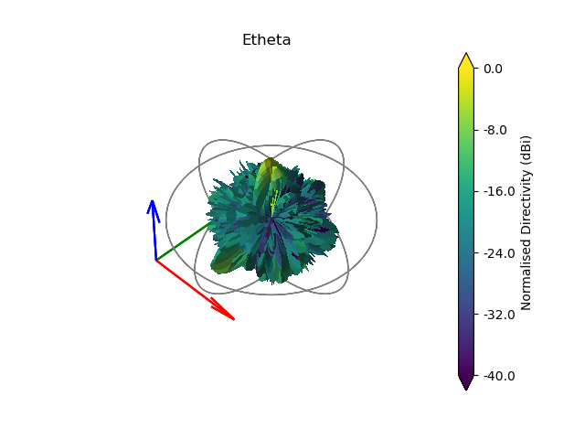

.. DO NOT EDIT.
.. THIS FILE WAS AUTOMATICALLY GENERATED BY SPHINX-GALLERY.
.. TO MAKE CHANGES, EDIT THE SOURCE PYTHON FILE:
.. "auto_examples\02_coherently_polarised_array.py"
.. LINE NUMBERS ARE GIVEN BELOW.

.. only:: html

    .. note::
        :class: sphx-glr-download-link-note

        Click :ref:`here <sphx_glr_download_auto_examples_02_coherently_polarised_array.py>`
        to download the full example code

.. rst-class:: sphx-glr-example-title

.. _sphx_glr_auto_examples_02_coherently_polarised_array.py:

Modelling a Coherently Polarised Aperture
======================================================

This example uses the frequency domain :func:`lyceanem.models.frequency_domain.calculate_farfield` function to predict
the farfield pattern for a linearly polarised aperture. This could represent an antenna array without any beamforming
weights.

.. GENERATED FROM PYTHON SOURCE LINES 13-17

.. code-block:: default

    import numpy as np
    import open3d as o3d
    import copy

.. GENERATED FROM PYTHON SOURCE LINES 18-27

Setting Farfield Resolution and Wavelength
-------------------------------------------
LyceanEM uses Elevation and Azimuth to record spherical coordinates, ranging from -180 to 180 degrees in azimuth,
and from -90 to 90 degrees in elevation. In order to launch the aperture projection function, the resolution in
both azimuth and elevation is requried.
In order to ensure a fast example, 37 points have been used here for both, giving a total of 1369 farfield points.

The wavelength of interest is also an important variable for antenna array analysis, so we set it now for 10GHz,
an X band aperture.

.. GENERATED FROM PYTHON SOURCE LINES 27-32

.. code-block:: default

    az_res = 181
    elev_res = 181
    wavelength = 3e8 / 10e9

.. GENERATED FROM PYTHON SOURCE LINES 33-37

Geometries
------------------------
In order to make things easy to start, an example geometry has been included within LyceanEM for a UAV, and the
:class:`open3d.geometry.TriangleMesh` structures can be accessed by importing the data subpackage

.. GENERATED FROM PYTHON SOURCE LINES 37-41

.. code-block:: default

    import lyceanem.tests.reflectordata as data

    body, array, source_coords = data.exampleUAV(10e9)

.. GENERATED FROM PYTHON SOURCE LINES 42-46

Visualise the Resultant UAV and Array
---------------------------------------
:func:`open3d.visualization.draw_geometries` can be used to visualise the open3d data
structures :class:`open3d.geometry.PointCloud` and :class:`open3d.geometry.PointCloud`

.. GENERATED FROM PYTHON SOURCE LINES 46-52

.. code-block:: default

    mesh_frame = o3d.geometry.TriangleMesh.create_coordinate_frame(
        size=0.5, origin=[0, 0, 0]
    )
    o3d.visualization.draw_geometries([body, array, source_coords, mesh_frame])

.. GENERATED FROM PYTHON SOURCE LINES 53-54

.. image:: ../_static/UAVArraywithPoints.png

.. GENERATED FROM PYTHON SOURCE LINES 54-77

.. code-block:: default

    # crop the inner surface of the array trianglemesh (not strictly required, as the UAV main body provides blocking to
    # the hidden surfaces, but correctly an aperture will only have an outer face.
    surface_array = copy.deepcopy(array)
    surface_array.triangles = o3d.utility.Vector3iVector(
        np.asarray(array.triangles)[: len(array.triangles) // 2, :]
    )
    surface_array.triangle_normals = o3d.utility.Vector3dVector(
        np.asarray(array.triangle_normals)[: len(array.triangle_normals) // 2, :]
    )

    from lyceanem.base_classes import structures

    blockers = structures([body, array])

    from lyceanem.models.frequency_domain import calculate_farfield

    from lyceanem.geometry.targets import source_cloud_from_shape

    source_points, _ = source_cloud_from_shape(surface_array, wavelength * 0.5)

    o3d.visualization.draw_geometries([body, array, source_points])

.. rst-class:: sphx-glr-script-out

 .. code-block:: none

    0.858793760075754
    0.6307553291661078
    0.3736530779617891
    0.18721894988353757
    0.034796457229518504
    0.03058959422793881
    -0.012054608990102791
    0.02742812135247836
    0.04455952883350341

.. GENERATED FROM PYTHON SOURCE LINES 78-79

.. image:: ../_static/sourcecloudfromshapeuav.png

.. GENERATED FROM PYTHON SOURCE LINES 81-86

Drawbacks of :func:`lyceanem.geometry.geometryfunctions.sourcecloudfromshape`
------------------------------------------------------------------------------
As can be seen by comparing the two source point sets, :func:`lyceanem.geometry.geometryfunctions.sourcecloudfromshape`
has a significant drawback when used for complex sharply curved antenna arrays, as the poisson disk sampling method
does not produce consistently spaced results.

.. GENERATED FROM PYTHON SOURCE LINES 86-101

.. code-block:: default

    desired_E_axis = np.zeros((1, 3), dtype=np.float32)
    desired_E_axis[0, 2] = 1.0

    Etheta, Ephi = calculate_farfield(
        source_coords,
        blockers,
        desired_E_axis,
        az_range=np.linspace(-180, 180, az_res),
        el_range=np.linspace(-90, 90, elev_res),
        wavelength=wavelength,
        farfield_distance=20,
        project_vectors=True,
    )

.. rst-class:: sphx-glr-script-out

 .. code-block:: none

    C:\Users\lycea\anaconda3\envs\cusignal-dev\lib\site-packages\numba\cuda\cudadrv\devicearray.py:885: NumbaPerformanceWarning: Host array used in CUDA kernel will incur copy overhead to/from device.
      warn(NumbaPerformanceWarning(msg))

.. GENERATED FROM PYTHON SOURCE LINES 102-110

Storing and Manipulating Antenna Patterns
---------------------------------------------
The resultant antenna pattern can be stored in :class:`lyceanem.base.antenna_pattern` as it has been modelled as one
distributed aperture, the advantage of this class is the integrated display, conversion and export functions. It is
very simple to define, and save the pattern, and then display with a call
to :func:`lyceanem.base.antenna_pattern.display_pattern`. This produces 3D polar plots which can be manipulated to
give a better view of the whole pattern, but if contour plots are required, then this can also be produced by passing
plottype='Contour' to the function.

.. GENERATED FROM PYTHON SOURCE LINES 110-121

.. code-block:: default

    from lyceanem.base_classes import antenna_pattern

    UAV_Static_Pattern = antenna_pattern(
        azimuth_resolution=az_res, elevation_resolution=elev_res
    )
    UAV_Static_Pattern.pattern[:, :, 0] = Etheta
    UAV_Static_Pattern.pattern[:, :, 0] = Ephi

    UAV_Static_Pattern.display_pattern()

.. rst-class:: sphx-glr-horizontal

    *

      .. image-sg:: /auto_examples/images/sphx_glr_02_coherently_polarised_array_001.png
         :alt: Etheta
         :srcset: /auto_examples/images/sphx_glr_02_coherently_polarised_array_001.png
         :class: sphx-glr-multi-img

    *

      .. image-sg:: /auto_examples/images/sphx_glr_02_coherently_polarised_array_002.png
         :alt: Ephi
         :srcset: /auto_examples/images/sphx_glr_02_coherently_polarised_array_002.png
         :class: sphx-glr-multi-img

.. rst-class:: sphx-glr-script-out

 .. code-block:: none

    C:\Users\lycea\PycharmProjects\LyceanEM-Python\lyceanem\electromagnetics\beamforming.py:1170: RuntimeWarning: divide by zero encountered in log10
      logdata = 20 * np.log10(data)
    C:\Users\lycea\PycharmProjects\LyceanEM-Python\lyceanem\electromagnetics\beamforming.py:1173: RuntimeWarning: invalid value encountered in subtract
      logdata -= np.nanmax(logdata)

.. GENERATED FROM PYTHON SOURCE LINES 122-124

.. GENERATED FROM PYTHON SOURCE LINES 124-127

.. code-block:: default

    UAV_Static_Pattern.display_pattern(plottype="Contour")

.. rst-class:: sphx-glr-horizontal

    *

      .. image-sg:: /auto_examples/images/sphx_glr_02_coherently_polarised_array_003.png
         :alt: Etheta
         :srcset: /auto_examples/images/sphx_glr_02_coherently_polarised_array_003.png
         :class: sphx-glr-multi-img

    *

      .. image-sg:: /auto_examples/images/sphx_glr_02_coherently_polarised_array_004.png
         :alt: Ephi
         :srcset: /auto_examples/images/sphx_glr_02_coherently_polarised_array_004.png
         :class: sphx-glr-multi-img

.. rst-class:: sphx-glr-script-out

 .. code-block:: none

    C:\Users\lycea\PycharmProjects\LyceanEM-Python\lyceanem\electromagnetics\beamforming.py:1170: RuntimeWarning: divide by zero encountered in log10
      logdata = 20 * np.log10(data)
    C:\Users\lycea\PycharmProjects\LyceanEM-Python\lyceanem\electromagnetics\beamforming.py:1173: RuntimeWarning: invalid value encountered in subtract
      logdata -= np.nanmax(logdata)
    C:\Users\lycea\anaconda3\envs\cusignal-dev\lib\site-packages\matplotlib\contour.py:1479: UserWarning: Warning: converting a masked element to nan.
      self.zmax = float(z.max())
    C:\Users\lycea\anaconda3\envs\cusignal-dev\lib\site-packages\matplotlib\contour.py:1480: UserWarning: Warning: converting a masked element to nan.
      self.zmin = float(z.min())
    C:\Users\lycea\PycharmProjects\LyceanEM-Python\lyceanem\electromagnetics\beamforming.py:1297: UserWarning: No contour levels were found within the data range.
      CS4 = ax.contour(

.. GENERATED FROM PYTHON SOURCE LINES 128-130

.. image:: ../_static/sphx_glr_02_coherently_polarised_array_003.png
.. image:: ../_static/sphx_glr_02_coherently_polarised_array_004.png

.. rst-class:: sphx-glr-timing

   **Total running time of the script:** ( 0 minutes  11.282 seconds)

.. _sphx_glr_download_auto_examples_02_coherently_polarised_array.py:

.. only:: html

  .. container:: sphx-glr-footer sphx-glr-footer-example

    .. container:: sphx-glr-download sphx-glr-download-python

      :download:`Download Python source code: 02_coherently_polarised_array.py <02_coherently_polarised_array.py>`

    .. container:: sphx-glr-download sphx-glr-download-jupyter

      :download:`Download Jupyter notebook: 02_coherently_polarised_array.ipynb <02_coherently_polarised_array.ipynb>`

.. only:: html

 .. rst-class:: sphx-glr-signature

    `Gallery generated by Sphinx-Gallery <https://sphinx-gallery.github.io>`_
