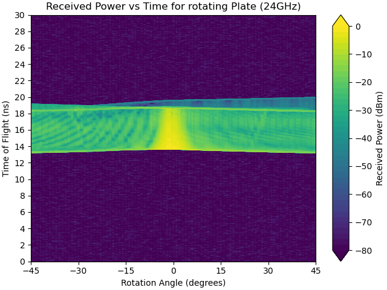
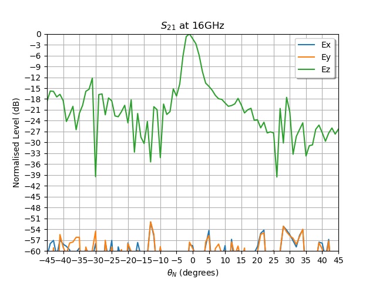

.. DO NOT EDIT.
.. THIS FILE WAS AUTOMATICALLY GENERATED BY SPHINX-GALLERY.
.. TO MAKE CHANGES, EDIT THE SOURCE PYTHON FILE:
.. "auto_examples/04_time_domain_channel_modelling.py"
.. LINE NUMBERS ARE GIVEN BELOW.

.. only:: html

    .. note::
        :class: sphx-glr-download-link-note

        Click :ref:`here <sphx_glr_download_auto_examples_04_time_domain_channel_modelling.py>`
        to download the full example code

.. rst-class:: sphx-glr-example-title

.. _sphx_glr_auto_examples_04_time_domain_channel_modelling.py:

Modelling a Physical Channel in the Time Domain
======================================================

This example uses the frequency domain :func:`lyceanem.models.time_domain.calculate_scattering` function to
predict the time domain response for a given excitation signal and environment included in the model.
This model allows for a very wide range of antennas and antenna arrays to be considered, but for simplicity only horn
antennas will be included in this example. The simplest case would be a single source point and single receive point,
rather than an aperture antenna such as a horn.

.. GENERATED FROM PYTHON SOURCE LINES 14-19

.. code-block:: default

    import numpy as np
    import open3d as o3d
    import copy

.. GENERATED FROM PYTHON SOURCE LINES 20-23

Frequency and Mesh Resolution
------------------------------

.. GENERATED FROM PYTHON SOURCE LINES 23-38

.. code-block:: default

    sampling_freq = 60e9
    model_time = 1e-7
    num_samples = int(model_time * (sampling_freq))

    # simulate receiver noise
    bandwidth = 8e9
    kb = 1.38065e-23
    receiver_impedence = 50
    thermal_noise_power = 4 * kb * 293.15 * receiver_impedence * bandwidth
    noise_power = -80  # dbw
    mean_noise = 0

    model_freq = 16e9
    wavelength = 3e8 / model_freq

.. GENERATED FROM PYTHON SOURCE LINES 39-42

Setup transmitters and receivers
-----------------------------------

.. GENERATED FROM PYTHON SOURCE LINES 42-52

.. code-block:: default

    import lyceanem.geometry.targets as TL
    import lyceanem.geometry.geometryfunctions as GF

    transmit_horn_structure, transmitting_antenna_surface_coords = TL.meshedHorn(
        58e-3, 58e-3, 128e-3, 2e-3, 0.21, wavelength * 0.5
    )
    receive_horn_structure, receiving_antenna_surface_coords = TL.meshedHorn(
        58e-3, 58e-3, 128e-3, 2e-3, 0.21, wavelength * 0.5
    )

.. GENERATED FROM PYTHON SOURCE LINES 53-59

Position Transmitter
----------------------
rotate the transmitting antenna to the desired orientation, and then translate to final position.
:func:`lyceanem.geometry.geometryfunctions.open3drotate` allows both the center of rotation to be defined, and
ensures the right syntax is used for Open3d, as it was changed from 0.9.0 to 0.10.0 and onwards.

.. GENERATED FROM PYTHON SOURCE LINES 59-79

.. code-block:: default

    rotation_vector1 = np.radians(np.asarray([90.0, 0.0, 0.0]))
    rotation_vector2 = np.radians(np.asarray([0.0, 0.0, -90.0]))
    transmit_horn_structure = GF.open3drotate(
        transmit_horn_structure,
        o3d.geometry.TriangleMesh.get_rotation_matrix_from_xyz(rotation_vector1),
    )
    transmit_horn_structure = GF.open3drotate(
        transmit_horn_structure,
        o3d.geometry.TriangleMesh.get_rotation_matrix_from_xyz(rotation_vector2),
    )
    transmit_horn_structure.translate(np.asarray([2.695, 0, 0]), relative=True)
    transmitting_antenna_surface_coords = GF.open3drotate(
        transmitting_antenna_surface_coords,
        o3d.geometry.TriangleMesh.get_rotation_matrix_from_xyz(rotation_vector1),
    )
    transmitting_antenna_surface_coords = GF.open3drotate(
        transmitting_antenna_surface_coords,
        o3d.geometry.TriangleMesh.get_rotation_matrix_from_xyz(rotation_vector2),
    )
    transmitting_antenna_surface_coords.translate(np.asarray([2.695, 0, 0]), relative=True)

.. rst-class:: sphx-glr-script-out

 Out:

 .. code-block:: none

    geometry::PointCloud with 49 points.

.. GENERATED FROM PYTHON SOURCE LINES 80-83

Position Receiver
------------------
rotate the receiving horn to desired orientation and translate to final position.

.. GENERATED FROM PYTHON SOURCE LINES 83-94

.. code-block:: default

    receive_horn_structure = GF.open3drotate(
        receive_horn_structure,
        o3d.geometry.TriangleMesh.get_rotation_matrix_from_xyz(rotation_vector1),
    )
    receive_horn_structure.translate(np.asarray([0, 1.427, 0]), relative=True)
    receiving_antenna_surface_coords = GF.open3drotate(
        receiving_antenna_surface_coords,
        o3d.geometry.TriangleMesh.get_rotation_matrix_from_xyz(rotation_vector1),
    )
    receiving_antenna_surface_coords.translate(np.asarray([0, 1.427, 0]), relative=True)

.. rst-class:: sphx-glr-script-out

 Out:

 .. code-block:: none

    geometry::PointCloud with 49 points.

.. GENERATED FROM PYTHON SOURCE LINES 95-98

Create Scattering Plate
--------------------------
Create a Scattering plate a source of multipath reflections

.. GENERATED FROM PYTHON SOURCE LINES 98-115

.. code-block:: default

    reflectorplate, scatter_points = TL.meshedReflector(
        0.3, 0.3, 6e-3, wavelength * 0.5, sides="front"
    )
    position_vector = np.asarray([29e-3, 0.0, 0])
    rotation_vector1 = np.radians(np.asarray([0.0, 90.0, 0.0]))
    scatter_points = GF.open3drotate(
        scatter_points,
        o3d.geometry.TriangleMesh.get_rotation_matrix_from_xyz(rotation_vector1),
    )
    reflectorplate = GF.open3drotate(
        reflectorplate,
        o3d.geometry.TriangleMesh.get_rotation_matrix_from_xyz(rotation_vector1),
    )
    reflectorplate.translate(position_vector, relative=True)
    scatter_points.translate(position_vector, relative=True)

.. rst-class:: sphx-glr-script-out

 Out:

 .. code-block:: none

    geometry::PointCloud with 1024 points.

.. GENERATED FROM PYTHON SOURCE LINES 116-119

Specify Reflection Angle
--------------------------
Rotate the scattering plate to the optimum angle for reflection from the transmitting to receiving horn

.. GENERATED FROM PYTHON SOURCE LINES 119-136

.. code-block:: default

    plate_orientation_angle = 45.0

    rotation_vector = np.radians(np.asarray([0.0, 0.0, plate_orientation_angle]))
    scatter_points = GF.open3drotate(
        scatter_points,
        o3d.geometry.TriangleMesh.get_rotation_matrix_from_xyz(rotation_vector),
    )
    reflectorplate = GF.open3drotate(
        reflectorplate,
        o3d.geometry.TriangleMesh.get_rotation_matrix_from_xyz(rotation_vector),
    )

    from lyceanem.base_classes import structures

    blockers = structures([reflectorplate, receive_horn_structure, transmit_horn_structure])

.. GENERATED FROM PYTHON SOURCE LINES 137-142

Visualise the Scene Geometry
------------------------------
Use open3d function :func:`open3d.visualization.draw_geometries` to visualise the scene and ensure that all the
relavent sources and scatter points are correct. Point normal vectors can be displayed by pressing 'n' while the
window is open.

.. GENERATED FROM PYTHON SOURCE LINES 142-156

.. code-block:: default

    mesh_frame = o3d.geometry.TriangleMesh.create_coordinate_frame(
        size=0.5, origin=[0, 0, 0]
    )
    o3d.visualization.draw_geometries(
        [
            transmitting_antenna_surface_coords,
            receiving_antenna_surface_coords,
            scatter_points,
            reflectorplate,
            mesh_frame,
            receive_horn_structure,
            transmit_horn_structure,
        ]
    )

.. GENERATED FROM PYTHON SOURCE LINES 157-158

.. image:: ../_static/03_frequency_domain_channel_model_picture_01.png

.. GENERATED FROM PYTHON SOURCE LINES 160-163

Specify desired Transmit Polarisation
--------------------------------------
The transmit polarisation has a significant effect on the channel characteristics. In this example the transmit horn will be vertically polarised, (e-vector aligned with the z direction)

.. GENERATED FROM PYTHON SOURCE LINES 163-167

.. code-block:: default

    desired_E_axis = np.zeros((1, 3), dtype=np.float32)
    desired_E_axis[0, 1] = 1.0

.. GENERATED FROM PYTHON SOURCE LINES 168-171

Time Domain Scattering
----------------------------

.. GENERATED FROM PYTHON SOURCE LINES 171-261

.. code-block:: default

    import scipy.signal as sig
    import lyceanem.models.time_domain as TD
    from lyceanem.base_classes import structures

    angle_values = np.linspace(0, 90, 91)
    angle_increment = np.diff(angle_values)[0]
    responsex = np.zeros((len(angle_values)), dtype="complex")
    responsey = np.zeros((len(angle_values)), dtype="complex")
    responsez = np.zeros((len(angle_values)), dtype="complex")

    plate_orientation_angle = -45.0

    rotation_vector = np.radians(
        np.asarray([0.0, 0.0, plate_orientation_angle + angle_increment])
    )
    scatter_points = GF.open3drotate(
        scatter_points,
        o3d.geometry.TriangleMesh.get_rotation_matrix_from_xyz(rotation_vector),
    )
    reflectorplate = GF.open3drotate(
        reflectorplate,
        o3d.geometry.TriangleMesh.get_rotation_matrix_from_xyz(rotation_vector),
    )

    from tqdm import tqdm

    wake_times = np.zeros((len(angle_values)))
    Ex = np.zeros((len(angle_values), num_samples))
    Ey = np.zeros((len(angle_values), num_samples))
    Ez = np.zeros((len(angle_values), num_samples))

    for angle_inc in tqdm(range(len(angle_values))):
        rotation_vector = np.radians(np.asarray([0.0, 0.0, angle_increment]))
        scatter_points = GF.open3drotate(
            scatter_points,
            o3d.geometry.TriangleMesh.get_rotation_matrix_from_xyz(rotation_vector),
        )
        reflectorplate = GF.open3drotate(
            reflectorplate,
            o3d.geometry.TriangleMesh.get_rotation_matrix_from_xyz(rotation_vector),
        )
        blockers = structures(
            [reflectorplate, transmit_horn_structure, receive_horn_structure]
        )
        pulse_time = 5e-9
        output_power = 0.01  # dBwatts
        powerdbm = 10 * np.log10(output_power) + 30
        v_transmit = ((10 ** (powerdbm / 20)) * receiver_impedence) ** 0.5
        output_amplitude_rms = v_transmit / (1 / np.sqrt(2))
        output_amplitude_peak = v_transmit

        desired_E_axis = np.zeros((3), dtype=np.float32)
        desired_E_axis[2] = 1.0
        noise_volts_peak = (10 ** (noise_power / 10) * receiver_impedence) * 0.5

        excitation_signal = output_amplitude_rms * sig.chirp(
            np.linspace(0, pulse_time, int(pulse_time * sampling_freq)),
            model_freq - bandwidth,
            pulse_time,
            model_freq,
            method="linear",
            phi=0,
            vertex_zero=True,
        ) + np.random.normal(mean_noise, noise_volts_peak, int(pulse_time * sampling_freq))
        (
            Ex[angle_inc, :],
            Ey[angle_inc, :],
            Ez[angle_inc, :],
            wake_times[angle_inc],
        ) = TD.calculate_scattering(
            transmitting_antenna_surface_coords,
            receiving_antenna_surface_coords,
            excitation_signal,
            blockers,
            desired_E_axis,
            scatter_points=scatter_points,
            wavelength=wavelength,
            scattering=1,
            elements=False,
            sampling_freq=sampling_freq,
            num_samples=num_samples,
        )

        noise_volts = np.random.normal(mean_noise, noise_volts_peak, num_samples)
        Ex[angle_inc, :] = Ex[angle_inc, :] + noise_volts
        Ey[angle_inc, :] = Ey[angle_inc, :] + noise_volts
        Ez[angle_inc, :] = Ez[angle_inc, :] + noise_volts

.. rst-class:: sphx-glr-script-out

 Out:

 .. code-block:: none


      0%|          | 0/91 [00:00<?, ?it/s]/home/timtitan/Documents/10-19-Research-Projects/14-Electromagnetics-Modelling/14.04-Python-Development/LyceanEM/lyceanem/electromagnetics/empropagation.py:3604: ComplexWarning: Casting complex values to real discards the imaginary part
      global_vector[0] = (
    /home/timtitan/Documents/10-19-Research-Projects/14-Electromagnetics-Modelling/14.04-Python-Development/LyceanEM/lyceanem/electromagnetics/empropagation.py:3609: ComplexWarning: Casting complex values to real discards the imaginary part
      global_vector[1] = (
    /home/timtitan/Documents/10-19-Research-Projects/14-Electromagnetics-Modelling/14.04-Python-Development/LyceanEM/lyceanem/electromagnetics/empropagation.py:3614: ComplexWarning: Casting complex values to real discards the imaginary part
      global_vector[2] = (

      1%|1         | 1/91 [00:10<16:29, 11.00s/it]/home/timtitan/Documents/10-19-Research-Projects/14-Electromagnetics-Modelling/14.04-Python-Development/LyceanEM/lyceanem/electromagnetics/empropagation.py:3604: ComplexWarning: Casting complex values to real discards the imaginary part
      global_vector[0] = (
    /home/timtitan/Documents/10-19-Research-Projects/14-Electromagnetics-Modelling/14.04-Python-Development/LyceanEM/lyceanem/electromagnetics/empropagation.py:3609: ComplexWarning: Casting complex values to real discards the imaginary part
      global_vector[1] = (
    /home/timtitan/Documents/10-19-Research-Projects/14-Electromagnetics-Modelling/14.04-Python-Development/LyceanEM/lyceanem/electromagnetics/empropagation.py:3614: ComplexWarning: Casting complex values to real discards the imaginary part
      global_vector[2] = (

      2%|2         | 2/91 [00:14<09:24,  6.35s/it]
      3%|3         | 3/91 [00:17<07:08,  4.87s/it]
      4%|4         | 4/91 [00:21<06:41,  4.62s/it]
      5%|5         | 5/91 [00:24<05:52,  4.10s/it]
      7%|6         | 6/91 [00:27<05:20,  3.77s/it]
      8%|7         | 7/91 [00:30<05:00,  3.57s/it]
      9%|8         | 8/91 [00:34<04:46,  3.45s/it]
     10%|9         | 9/91 [00:37<04:31,  3.31s/it]
     11%|#         | 10/91 [00:40<04:21,  3.23s/it]
     12%|#2        | 11/91 [00:43<04:12,  3.16s/it]
     13%|#3        | 12/91 [00:46<04:09,  3.16s/it]
     14%|#4        | 13/91 [00:49<04:03,  3.13s/it]
     15%|#5        | 14/91 [00:52<03:58,  3.10s/it]
     16%|#6        | 15/91 [00:55<03:55,  3.10s/it]
     18%|#7        | 16/91 [00:58<03:50,  3.08s/it]
     19%|#8        | 17/91 [01:01<03:45,  3.05s/it]
     20%|#9        | 18/91 [01:04<03:44,  3.07s/it]
     21%|##        | 19/91 [01:07<03:42,  3.09s/it]
     22%|##1       | 20/91 [01:10<03:38,  3.08s/it]
     23%|##3       | 21/91 [01:13<03:35,  3.07s/it]
     24%|##4       | 22/91 [01:16<03:28,  3.02s/it]
     25%|##5       | 23/91 [01:19<03:23,  2.99s/it]
     26%|##6       | 24/91 [01:22<03:19,  2.98s/it]
     27%|##7       | 25/91 [01:25<03:16,  2.97s/it]
     29%|##8       | 26/91 [01:28<03:14,  2.99s/it]
     30%|##9       | 27/91 [01:31<03:14,  3.04s/it]
     31%|###       | 28/91 [01:34<03:08,  2.99s/it]
     32%|###1      | 29/91 [01:38<03:14,  3.14s/it]
     33%|###2      | 30/91 [01:41<03:13,  3.17s/it]
     34%|###4      | 31/91 [01:44<03:11,  3.20s/it]
     35%|###5      | 32/91 [01:47<03:04,  3.13s/it]
     36%|###6      | 33/91 [01:50<02:59,  3.10s/it]
     37%|###7      | 34/91 [01:54<03:04,  3.24s/it]
     38%|###8      | 35/91 [01:57<03:10,  3.41s/it]
     40%|###9      | 36/91 [02:01<03:03,  3.34s/it]
     41%|####      | 37/91 [02:04<02:53,  3.21s/it]
     42%|####1     | 38/91 [02:07<02:50,  3.22s/it]
     43%|####2     | 39/91 [02:10<02:44,  3.17s/it]
     44%|####3     | 40/91 [02:13<02:42,  3.19s/it]
     45%|####5     | 41/91 [02:16<02:37,  3.15s/it]
     46%|####6     | 42/91 [02:19<02:29,  3.05s/it]
     47%|####7     | 43/91 [02:22<02:22,  2.96s/it]
     48%|####8     | 44/91 [02:25<02:17,  2.92s/it]
     49%|####9     | 45/91 [02:27<02:13,  2.89s/it]
     51%|#####     | 46/91 [02:30<02:11,  2.91s/it]
     52%|#####1    | 47/91 [02:33<02:06,  2.88s/it]
     53%|#####2    | 48/91 [02:36<02:03,  2.86s/it]
     54%|#####3    | 49/91 [02:39<02:00,  2.87s/it]
     55%|#####4    | 50/91 [02:42<01:56,  2.85s/it]
     56%|#####6    | 51/91 [02:45<01:53,  2.84s/it]
     57%|#####7    | 52/91 [02:47<01:50,  2.83s/it]
     58%|#####8    | 53/91 [02:50<01:46,  2.79s/it]
     59%|#####9    | 54/91 [02:53<01:43,  2.79s/it]
     60%|######    | 55/91 [02:56<01:40,  2.80s/it]
     62%|######1   | 56/91 [02:58<01:37,  2.79s/it]
     63%|######2   | 57/91 [03:01<01:34,  2.77s/it]
     64%|######3   | 58/91 [03:04<01:30,  2.75s/it]
     65%|######4   | 59/91 [03:07<01:28,  2.75s/it]
     66%|######5   | 60/91 [03:09<01:25,  2.74s/it]
     67%|######7   | 61/91 [03:12<01:22,  2.75s/it]
     68%|######8   | 62/91 [03:15<01:20,  2.77s/it]
     69%|######9   | 63/91 [03:18<01:18,  2.80s/it]
     70%|#######   | 64/91 [03:21<01:15,  2.80s/it]
     71%|#######1  | 65/91 [03:23<01:12,  2.79s/it]
     73%|#######2  | 66/91 [03:26<01:10,  2.82s/it]
     74%|#######3  | 67/91 [03:29<01:07,  2.81s/it]
     75%|#######4  | 68/91 [03:32<01:04,  2.82s/it]
     76%|#######5  | 69/91 [03:35<01:02,  2.83s/it]
     77%|#######6  | 70/91 [03:38<01:00,  2.86s/it]
     78%|#######8  | 71/91 [03:41<00:57,  2.87s/it]
     79%|#######9  | 72/91 [03:43<00:54,  2.89s/it]
     80%|########  | 73/91 [03:46<00:52,  2.93s/it]
     81%|########1 | 74/91 [03:50<00:50,  2.96s/it]
     82%|########2 | 75/91 [03:52<00:47,  2.95s/it]
     84%|########3 | 76/91 [03:55<00:43,  2.93s/it]
     85%|########4 | 77/91 [03:58<00:41,  2.94s/it]
     86%|########5 | 78/91 [04:01<00:38,  2.93s/it]
     87%|########6 | 79/91 [04:04<00:35,  2.94s/it]
     88%|########7 | 80/91 [04:07<00:32,  2.95s/it]
     89%|########9 | 81/91 [04:10<00:29,  2.97s/it]
     90%|######### | 82/91 [04:13<00:27,  3.05s/it]
     91%|#########1| 83/91 [04:16<00:24,  3.08s/it]
     92%|#########2| 84/91 [04:19<00:21,  3.05s/it]
     93%|#########3| 85/91 [04:22<00:17,  2.99s/it]
     95%|#########4| 86/91 [04:25<00:14,  2.95s/it]
     96%|#########5| 87/91 [04:28<00:11,  2.92s/it]
     97%|#########6| 88/91 [04:30<00:08,  2.71s/it]
     98%|#########7| 89/91 [04:31<00:04,  2.19s/it]
     99%|#########8| 90/91 [04:32<00:01,  1.76s/it]
    100%|##########| 91/91 [04:33<00:00,  1.45s/it]
    100%|##########| 91/91 [04:33<00:00,  3.00s/it]

.. GENERATED FROM PYTHON SOURCE LINES 262-265

Plot Normalised Response
----------------------------
Using matplotlib, plot the results

.. GENERATED FROM PYTHON SOURCE LINES 265-324

.. code-block:: default

    import matplotlib.pyplot as plt

    time_index = np.linspace(0, model_time * 1e9, num_samples)
    time, anglegrid = np.meshgrid(time_index[:1801], angle_values - 45)
    norm_max = np.nanmax(
        np.array(
            [
                np.nanmax(10 * np.log10((Ex ** 2) / receiver_impedence)),
                np.nanmax(10 * np.log10((Ey ** 2) / receiver_impedence)),
                np.nanmax(10 * np.log10((Ez ** 2) / receiver_impedence)),
            ]
        )
    )

    fig2, ax2 = plt.subplots(constrained_layout=True)
    origin = "lower"
    # Now make a contour plot with the levels specified,
    # and with the colormap generated automatically from a list
    # of colors.

    levels = np.linspace(-80, 0, 41)

    CS = ax2.contourf(
        anglegrid,
        time,
        10 * np.log10((Ez[:, :1801] ** 2) / receiver_impedence) - norm_max,
        levels,
        origin=origin,
        extend="both",
    )
    cbar = fig2.colorbar(CS)
    cbar.ax.set_ylabel("Received Power (dBm)")

    ax2.set_ylim(0, 30)
    ax2.set_xlim(-45, 45)

    ax2.set_xticks(np.linspace(-45, 45, 7))
    ax2.set_yticks(np.linspace(0, 30, 16))

    ax2.set_xlabel("Rotation Angle (degrees)")
    ax2.set_ylabel("Time of Flight (ns)")
    ax2.set_title("Received Power vs Time for rotating Plate (24GHz)")

    from scipy.fft import fft, fftfreq
    import scipy

    xf = fftfreq(len(time_index), 1 / sampling_freq)[: len(time_index) // 2]
    input_signal = excitation_signal * (output_amplitude_peak)
    inputfft = fft(input_signal)
    input_freq = fftfreq(120, 1 / sampling_freq)[:60]
    freqfuncabs = scipy.interpolate.interp1d(input_freq, np.abs(inputfft[:60]))
    freqfuncangle = scipy.interpolate.interp1d(input_freq, np.angle(inputfft[:60]))
    newinput = freqfuncabs(xf[1600]) * np.exp(freqfuncangle(xf[1600]))
    Exf = fft(Ex)
    Eyf = fft(Ey)
    Ezf = fft(Ez)

.. image-sg:: /auto_examples/images/sphx_glr_04_time_domain_channel_modelling_001.png
   :alt: Received Power vs Time for rotating Plate (24GHz)
   :srcset: /auto_examples/images/sphx_glr_04_time_domain_channel_modelling_001.png
   :class: sphx-glr-single-img

.. GENERATED FROM PYTHON SOURCE LINES 325-326

.. GENERATED FROM PYTHON SOURCE LINES 328-333

Frequency Specific Results
-------------------------------
The time of flight plot is useful to displaying the output of the model, giving a understanding about what is
physically happening in the channel, but to get an idea of the behaviour in the frequency domain we need to use a
fourier transform to move from time and voltages to frequency.

.. GENERATED FROM PYTHON SOURCE LINES 333-353

.. code-block:: default

    s21x = 20 * np.log10(np.abs(Exf[:, 1600] / newinput))
    s21y = 20 * np.log10(np.abs(Eyf[:, 1600] / newinput))
    s21z = 20 * np.log10(np.abs(Ezf[:, 1600] / newinput))
    tdangles = np.linspace(-45, 45, 91)
    fig, ax = plt.subplots()
    ax.plot(tdangles, s21x - np.max(s21z), label="Ex")
    ax.plot(tdangles, s21y - np.max(s21z), label="Ey")
    ax.plot(tdangles, s21z - np.max(s21z), label="Ez")
    plt.xlabel("$\\theta_{N}$ (degrees)")
    plt.ylabel("Normalised Level (dB)")
    ax.set_ylim(-60.0, 0)
    ax.set_xlim(np.min(angle_values) - 45, np.max(angle_values) - 45)
    ax.set_xticks(np.linspace(np.min(angle_values) - 45, np.max(angle_values) - 45, 19))
    ax.set_yticks(np.linspace(-60, 0.0, 21))
    legend = ax.legend(loc="upper right", shadow=True)
    plt.grid()
    plt.title("$S_{21}$ at 16GHz")
    plt.show()

.. image-sg:: /auto_examples/images/sphx_glr_04_time_domain_channel_modelling_002.png
   :alt: $S_{21}$ at 16GHz
   :srcset: /auto_examples/images/sphx_glr_04_time_domain_channel_modelling_002.png
   :class: sphx-glr-single-img

.. GENERATED FROM PYTHON SOURCE LINES 354-355

.. rst-class:: sphx-glr-timing

   **Total running time of the script:** ( 4 minutes  43.360 seconds)

.. _sphx_glr_download_auto_examples_04_time_domain_channel_modelling.py:

.. only :: html

 .. container:: sphx-glr-footer
    :class: sphx-glr-footer-example

  .. container:: sphx-glr-download sphx-glr-download-python

     :download:`Download Python source code: 04_time_domain_channel_modelling.py <04_time_domain_channel_modelling.py>`

  .. container:: sphx-glr-download sphx-glr-download-jupyter

     :download:`Download Jupyter notebook: 04_time_domain_channel_modelling.ipynb <04_time_domain_channel_modelling.ipynb>`

.. only:: html

 .. rst-class:: sphx-glr-signature

    `Gallery generated by Sphinx-Gallery <https://sphinx-gallery.github.io>`_
