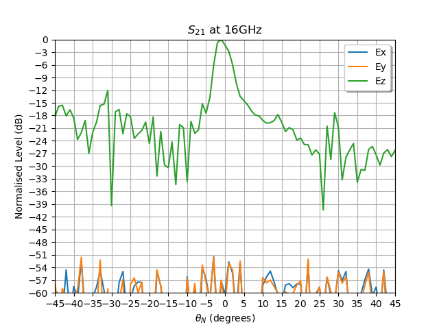

.. DO NOT EDIT.
.. THIS FILE WAS AUTOMATICALLY GENERATED BY SPHINX-GALLERY.
.. TO MAKE CHANGES, EDIT THE SOURCE PYTHON FILE:
.. "auto_examples\04_time_domain_channel_modelling.py"
.. LINE NUMBERS ARE GIVEN BELOW.

.. only:: html

    .. note::
        :class: sphx-glr-download-link-note

        :ref:`Go to the end <sphx_glr_download_auto_examples_04_time_domain_channel_modelling.py>`
        to download the full example code.

.. rst-class:: sphx-glr-example-title

.. _sphx_glr_auto_examples_04_time_domain_channel_modelling.py:

Modelling a Physical Channel in the Time Domain
======================================================

This example uses the frequency domain :func:`lyceanem.models.time_domain.calculate_scattering` function to
predict the time domain response for a given excitation signal and environment included in the model.
This model allows for a very wide range of antennas and antenna arrays to be considered, but for simplicity only horn
antennas will be included in this example. The simplest case would be a single source point and single receive point,
rather than an aperture antenna such as a horn.

.. GENERATED FROM PYTHON SOURCE LINES 14-17

.. code-block:: Python

    import numpy as np
    import meshio

.. GENERATED FROM PYTHON SOURCE LINES 18-21

Frequency and Mesh Resolution
------------------------------

.. GENERATED FROM PYTHON SOURCE LINES 21-36

.. code-block:: Python

    sampling_freq = 60e9
    model_time = 1e-7
    num_samples = int(model_time * (sampling_freq))

    # simulate receiver noise
    bandwidth = 8e9
    kb = 1.38065e-23
    receiver_impedence = 50
    thermal_noise_power = 4 * kb * 293.15 * receiver_impedence * bandwidth
    noise_power = -80  # dbw
    mean_noise = 0

    model_freq = 24e9
    wavelength = 3e8 / model_freq

.. GENERATED FROM PYTHON SOURCE LINES 37-40

Setup transmitters and receivers
-----------------------------------

.. GENERATED FROM PYTHON SOURCE LINES 40-50

.. code-block:: Python

    import lyceanem.geometry.targets as TL
    import lyceanem.geometry.geometryfunctions as GF

    transmit_horn_structure, transmitting_antenna_surface_coords = TL.meshedHorn(
        58e-3, 58e-3, 128e-3, 2e-3, 0.21, wavelength * 0.5
    )
    receive_horn_structure, receiving_antenna_surface_coords = TL.meshedHorn(
        58e-3, 58e-3, 128e-3, 2e-3, 0.21, wavelength * 0.5
    )

.. rst-class:: sphx-glr-script-out

 .. code-block:: none

    HIHIH
    <meshio mesh object>
      Number of points: 8
      Number of cells:
        triangle: 12
    HIHIH
    <meshio mesh object>
      Number of points: 8
      Number of cells:
        triangle: 12

.. GENERATED FROM PYTHON SOURCE LINES 51-57

Position Transmitter
----------------------
rotate the transmitting antenna to the desired orientation, and then translate to final position.
:func:`lyceanem.geometry.geometryfunctions.open3drotate` allows both the center of rotation to be defined, and
ensures the right syntax is used for Open3d, as it was changed from 0.9.0 to 0.10.0 and onwards.

.. GENERATED FROM PYTHON SOURCE LINES 57-68

.. code-block:: Python

    rotation_vector1 = np.radians(np.asarray([90.0, 0.0, 0.0]))
    rotation_vector2 = np.radians(np.asarray([0.0, 0.0, -90.0]))

    transmit_horn_structure = GF.mesh_rotate(transmit_horn_structure, rotation_vector1)
    transmit_horn_structure = GF.mesh_rotate(transmit_horn_structure, rotation_vector2)
    transmit_horn_structure = GF.translate_mesh(transmit_horn_structure, np.asarray([2.695, 0, 0]))
    transmitting_antenna_surface_coords = GF.mesh_rotate(transmitting_antenna_surface_coords, rotation_vector1)
    transmitting_antenna_surface_coords = GF.mesh_rotate(transmitting_antenna_surface_coords, rotation_vector2)
    transmitting_antenna_surface_coords = GF.translate_mesh(transmitting_antenna_surface_coords, np.asarray([2.695, 0, 0]))

.. GENERATED FROM PYTHON SOURCE LINES 69-72

Position Receiver
------------------
rotate the receiving horn to desired orientation and translate to final position.

.. GENERATED FROM PYTHON SOURCE LINES 72-79

.. code-block:: Python

    receive_horn_structure = GF.mesh_rotate(receive_horn_structure, rotation_vector1)
    receive_horn_structure = GF.translate_mesh(receive_horn_structure, np.asarray([0, 1.427, 0]))
    receiving_antenna_surface_coords = GF.mesh_rotate(receiving_antenna_surface_coords, rotation_vector1)
    receiving_antenna_surface_coords = GF.translate_mesh(receiving_antenna_surface_coords, np.asarray([0, 1.427, 0]))

.. GENERATED FROM PYTHON SOURCE LINES 80-83

Create Scattering Plate
--------------------------
Create a Scattering plate a source of multipath reflections

.. GENERATED FROM PYTHON SOURCE LINES 83-95

.. code-block:: Python

    reflectorplate, scatter_points = TL.meshedReflector(
        0.3, 0.3, 6e-3, wavelength * 0.5, sides="front"
    )
    position_vector = np.asarray([29e-3, 0.0, 0])
    rotation_vector1 = np.radians(np.asarray([0.0, 90.0, 0.0]))
    scatter_points = GF.mesh_rotate(scatter_points, rotation_vector1)
    reflectorplate = GF.mesh_rotate(reflectorplate, rotation_vector1)
    reflectorplate = GF.translate_mesh(reflectorplate, position_vector)
    scatter_points = GF.translate_mesh(scatter_points, position_vector)

.. rst-class:: sphx-glr-script-out

 .. code-block:: none

    meshing reflector
    args 0.3 0.3 0.006
    majorsize 0.3
    minorsize 0.3
    thickness 0.006

.. GENERATED FROM PYTHON SOURCE LINES 96-99

Specify Reflection Angle
--------------------------
Rotate the scattering plate to the optimum angle for reflection from the transmitting to receiving horn

.. GENERATED FROM PYTHON SOURCE LINES 99-110

.. code-block:: Python

    plate_orientation_angle = 45.0

    rotation_vector = np.radians(np.asarray([0.0, 0.0, plate_orientation_angle]))
    scatter_points = GF.mesh_rotate(scatter_points, rotation_vector)
    reflectorplate = GF.mesh_rotate(reflectorplate, rotation_vector)
    from lyceanem.base_classes import structures

    blockers = structures([reflectorplate, receive_horn_structure, transmit_horn_structure])

.. GENERATED FROM PYTHON SOURCE LINES 111-113

Visualise the Scene Geometry
------------------------------

.. GENERATED FROM PYTHON SOURCE LINES 113-132

.. code-block:: Python

    import pyvista as pv

    def structure_cells(array):
        ## add collumn of 3s to beggining of each row
        array = np.append(np.ones((array.shape[0], 1), dtype=np.int32) * 3, array, axis=1)
        return array
    pyvista_mesh = pv.PolyData(reflectorplate.points, structure_cells(reflectorplate.cells[0].data))
    pyvista_mesh2 = pv.PolyData(receive_horn_structure.points, structure_cells(receive_horn_structure.cells[0].data))
    pyvista_mesh3 = pv.PolyData(transmit_horn_structure.points, structure_cells(transmit_horn_structure.cells[0].data))
    ## plot the mesh
    plotter = pv.Plotter()
    plotter.add_mesh(pyvista_mesh, color="white", show_edges=True)
    plotter.add_mesh(pyvista_mesh2, color="blue", show_edges=True)
    plotter.add_mesh(pyvista_mesh3, color="red", show_edges=True)
    plotter.add_axes_at_origin()
    plotter.show()

.. image-sg:: /auto_examples/images/sphx_glr_04_time_domain_channel_modelling_001.png
   :alt: 04 time domain channel modelling
   :srcset: /auto_examples/images/sphx_glr_04_time_domain_channel_modelling_001.png
   :class: sphx-glr-single-img

.. GENERATED FROM PYTHON SOURCE LINES 133-136

Specify desired Transmit Polarisation
--------------------------------------
The transmit polarisation has a significant effect on the channel characteristics. In this example the transmit horn will be vertically polarised, (e-vector aligned with the z direction)

.. GENERATED FROM PYTHON SOURCE LINES 136-140

.. code-block:: Python

    desired_E_axis = np.zeros((1, 3), dtype=np.float32)
    desired_E_axis[0, 1] = 1.0

.. GENERATED FROM PYTHON SOURCE LINES 141-144

Time Domain Scattering
----------------------------

.. GENERATED FROM PYTHON SOURCE LINES 144-222

.. code-block:: Python

    import scipy.signal as sig
    import lyceanem.models.time_domain as TD
    from lyceanem.base_classes import structures

    angle_values = np.linspace(0, 90, 91)
    angle_increment = np.diff(angle_values)[0]
    responsex = np.zeros((len(angle_values)), dtype="complex")
    responsey = np.zeros((len(angle_values)), dtype="complex")
    responsez = np.zeros((len(angle_values)), dtype="complex")

    plate_orientation_angle = -45.0

    rotation_vector = np.radians(
        np.asarray([0.0, 0.0, plate_orientation_angle + angle_increment])
    )
    scatter_points = GF.mesh_rotate(scatter_points, rotation_vector)
    reflectorplate = GF.mesh_rotate(reflectorplate, rotation_vector)

    from tqdm import tqdm

    wake_times = np.zeros((len(angle_values)))
    Ex = np.zeros((len(angle_values), num_samples))
    Ey = np.zeros((len(angle_values), num_samples))
    Ez = np.zeros((len(angle_values), num_samples))

    for angle_inc in tqdm(range(len(angle_values))):
        rotation_vector = np.radians(np.asarray([0.0, 0.0, angle_increment]))
        scatter_points = GF.mesh_rotate(scatter_points, rotation_vector)
        reflectorplate = GF.mesh_rotate(reflectorplate, rotation_vector)
        blockers = structures(
            [reflectorplate, transmit_horn_structure, receive_horn_structure]
        )
        pulse_time = 5e-9
        output_power = 0.01  # dBwatts
        powerdbm = 10 * np.log10(output_power) + 30
        v_transmit = ((10 ** (powerdbm / 20)) * receiver_impedence) ** 0.5
        output_amplitude_rms = v_transmit / (1 / np.sqrt(2))
        output_amplitude_peak = v_transmit

        desired_E_axis = np.zeros((3), dtype=np.float32)
        desired_E_axis[1] = 1.0
        noise_volts_peak = (10 ** (noise_power / 10) * receiver_impedence) * 0.5

        excitation_signal = output_amplitude_rms * sig.chirp(
            np.linspace(0, pulse_time, int(pulse_time * sampling_freq)),
            model_freq - bandwidth,
            pulse_time,
            model_freq,
            method="linear",
            phi=0,
            vertex_zero=True,
        ) + np.random.normal(mean_noise, noise_volts_peak, int(pulse_time * sampling_freq))
        (
            Ex[angle_inc, :],
            Ey[angle_inc, :],
            Ez[angle_inc, :],
            wake_times[angle_inc],
        ) = TD.calculate_scattering(
            transmitting_antenna_surface_coords,
            receiving_antenna_surface_coords,
            excitation_signal,
            blockers,
            desired_E_axis,
            scatter_points=scatter_points,
            wavelength=wavelength,
            scattering=1,
            elements=False,
            sampling_freq=sampling_freq,
            num_samples=num_samples,
        )

        noise_volts = np.random.normal(mean_noise, noise_volts_peak, num_samples)
        Ex[angle_inc, :] = Ex[angle_inc, :] + noise_volts
        Ey[angle_inc, :] = Ey[angle_inc, :] + noise_volts
        Ez[angle_inc, :] = Ez[angle_inc, :] + noise_volts

.. rst-class:: sphx-glr-script-out

 .. code-block:: none


      0%|                                                                                                                                                                                                       | 0/91 [00:00<?, ?it/s]C:\Users\lycea\PycharmProjects\LyceanEM-Python\lyceanem\electromagnetics\empropagation.py:3670: ComplexWarning: Casting complex values to real discards the imaginary part
      uvn_axes[2, :] = point_vector
    C:\Users\lycea\PycharmProjects\LyceanEM-Python\lyceanem\electromagnetics\empropagation.py:3687: ComplexWarning: Casting complex values to real discards the imaginary part
      uvn_axes[0, :] = np.cross(local_axes[2, :], point_vector) / np.linalg.norm(
    C:\Users\lycea\PycharmProjects\LyceanEM-Python\lyceanem\electromagnetics\empropagation.py:3709: ComplexWarning: Casting complex values to real discards the imaginary part
      uvn_axes[1, :] = np.cross(point_vector, uvn_axes[0, :]) / np.linalg.norm(
    sources shape (100, 3)
    sinks shape (100, 3)
    environment_points shape (2304, 3)
    sources shape (100, 3)
    sinks shape (100, 3)
    environment_points shape (2304, 3)
    source chunking  1.44 Gb
    [1.31761529e-08 1.31761529e-08]
    (100, 100, 6000, 3)
    [  0  50 100]

      1%|██                                                                                                                                                                                             | 1/91 [00:18<27:52, 18.58s/it]C:\Users\lycea\PycharmProjects\LyceanEM-Python\lyceanem\electromagnetics\empropagation.py:3670: ComplexWarning: Casting complex values to real discards the imaginary part
      uvn_axes[2, :] = point_vector
    C:\Users\lycea\PycharmProjects\LyceanEM-Python\lyceanem\electromagnetics\empropagation.py:3687: ComplexWarning: Casting complex values to real discards the imaginary part
      uvn_axes[0, :] = np.cross(local_axes[2, :], point_vector) / np.linalg.norm(
    C:\Users\lycea\PycharmProjects\LyceanEM-Python\lyceanem\electromagnetics\empropagation.py:3709: ComplexWarning: Casting complex values to real discards the imaginary part
      uvn_axes[1, :] = np.cross(point_vector, uvn_axes[0, :]) / np.linalg.norm(
    sources shape (100, 3)
    sinks shape (100, 3)
    environment_points shape (2304, 3)
    sources shape (100, 3)
    sinks shape (100, 3)
    environment_points shape (2304, 3)
    source chunking  1.44 Gb
    [1.31836961e-08 1.31836961e-08]
    (100, 100, 6000, 3)
    [  0  50 100]

      2%|████▏                                                                                                                                                                                          | 2/91 [00:28<20:24, 13.76s/it]sources shape (100, 3)
    sinks shape (100, 3)
    environment_points shape (2304, 3)
    sources shape (100, 3)
    sinks shape (100, 3)
    environment_points shape (2304, 3)
    source chunking  1.44 Gb
    [1.31914115e-08 1.31914115e-08]
    (100, 100, 6000, 3)
    [  0  50 100]

      3%|██████▎                                                                                                                                                                                        | 3/91 [00:39<17:53, 12.20s/it]sources shape (100, 3)
    sinks shape (100, 3)
    environment_points shape (2304, 3)
    sources shape (100, 3)
    sinks shape (100, 3)
    environment_points shape (2304, 3)
    source chunking  1.44 Gb
    [1.3199282e-08 1.3199282e-08]
    (100, 100, 6000, 3)
    [  0  50 100]

      4%|████████▍                                                                                                                                                                                      | 4/91 [00:49<16:37, 11.47s/it]sources shape (100, 3)
    sinks shape (100, 3)
    environment_points shape (2304, 3)
    sources shape (100, 3)
    sinks shape (100, 3)
    environment_points shape (2304, 3)
    source chunking  1.44 Gb
    [1.32073326e-08 1.32073326e-08]
    (100, 100, 6000, 3)
    [  0  50 100]

      5%|██████████▍                                                                                                                                                                                    | 5/91 [01:00<15:54, 11.10s/it]sources shape (100, 3)
    sinks shape (100, 3)
    environment_points shape (2304, 3)
    sources shape (100, 3)
    sinks shape (100, 3)
    environment_points shape (2304, 3)
    source chunking  1.44 Gb
    [1.32155228e-08 1.32155228e-08]
    (100, 100, 6000, 3)
    [  0  50 100]

      7%|████████████▌                                                                                                                                                                                  | 6/91 [01:10<15:21, 10.84s/it]sources shape (100, 3)
    sinks shape (100, 3)
    environment_points shape (2304, 3)
    sources shape (100, 3)
    sinks shape (100, 3)
    environment_points shape (2304, 3)
    source chunking  1.44 Gb
    [1.32238859e-08 1.32238859e-08]
    (100, 100, 6000, 3)
    [  0  50 100]

      8%|██████████████▋                                                                                                                                                                                | 7/91 [01:20<14:59, 10.71s/it]sources shape (100, 3)
    sinks shape (100, 3)
    environment_points shape (2304, 3)
    sources shape (100, 3)
    sinks shape (100, 3)
    environment_points shape (2304, 3)
    source chunking  1.44 Gb
    [1.32324022e-08 1.32324022e-08]
    (100, 100, 6000, 3)
    [  0  50 100]

      9%|████████████████▊                                                                                                                                                                              | 8/91 [01:31<14:40, 10.61s/it]sources shape (100, 3)
    sinks shape (100, 3)
    environment_points shape (2304, 3)
    sources shape (100, 3)
    sinks shape (100, 3)
    environment_points shape (2304, 3)
    source chunking  1.44 Gb
    [1.32410656e-08 1.32410656e-08]
    (100, 100, 6000, 3)
    [  0  50 100]

     10%|██████████████████▉                                                                                                                                                                            | 9/91 [01:41<14:22, 10.51s/it]sources shape (100, 3)
    sinks shape (100, 3)
    environment_points shape (2304, 3)
    sources shape (100, 3)
    sinks shape (100, 3)
    environment_points shape (2304, 3)
    source chunking  1.44 Gb
    [1.32498967e-08 1.32498967e-08]
    (100, 100, 6000, 3)
    [  0  50 100]

     11%|████████████████████▉                                                                                                                                                                         | 10/91 [01:51<14:08, 10.47s/it]sources shape (100, 3)
    sinks shape (100, 3)
    environment_points shape (2304, 3)
    sources shape (100, 3)
    sinks shape (100, 3)
    environment_points shape (2304, 3)
    source chunking  1.44 Gb
    [1.32588512e-08 1.32588512e-08]
    (100, 100, 6000, 3)
    [  0  50 100]

     12%|██████████████████████▉                                                                                                                                                                       | 11/91 [02:02<13:54, 10.43s/it]sources shape (100, 3)
    sinks shape (100, 3)
    environment_points shape (2304, 3)
    sources shape (100, 3)
    sinks shape (100, 3)
    environment_points shape (2304, 3)
    source chunking  1.44 Gb
    [1.3267971e-08 1.3267971e-08]
    (100, 100, 6000, 3)
    [  0  50 100]

     13%|█████████████████████████                                                                                                                                                                     | 12/91 [02:12<13:40, 10.39s/it]sources shape (100, 3)
    sinks shape (100, 3)
    environment_points shape (2304, 3)
    sources shape (100, 3)
    sinks shape (100, 3)
    environment_points shape (2304, 3)
    source chunking  1.44 Gb
    [1.32772209e-08 1.32772209e-08]
    (100, 100, 6000, 3)
    [  0  50 100]

     14%|███████████████████████████▏                                                                                                                                                                  | 13/91 [02:23<13:33, 10.43s/it]sources shape (100, 3)
    sinks shape (100, 3)
    environment_points shape (2304, 3)
    sources shape (100, 3)
    sinks shape (100, 3)
    environment_points shape (2304, 3)
    source chunking  1.44 Gb
    [1.32866152e-08 1.32866152e-08]
    (100, 100, 6000, 3)
    [  0  50 100]

     15%|█████████████████████████████▏                                                                                                                                                                | 14/91 [02:33<13:21, 10.41s/it]sources shape (100, 3)
    sinks shape (100, 3)
    environment_points shape (2304, 3)
    sources shape (100, 3)
    sinks shape (100, 3)
    environment_points shape (2304, 3)
    source chunking  1.44 Gb
    [1.32961541e-08 1.32961541e-08]
    (100, 100, 6000, 3)
    [  0  50 100]

     16%|███████████████████████████████▎                                                                                                                                                              | 15/91 [02:43<13:10, 10.40s/it]sources shape (100, 3)
    sinks shape (100, 3)
    environment_points shape (2304, 3)
    sources shape (100, 3)
    sinks shape (100, 3)
    environment_points shape (2304, 3)
    source chunking  1.44 Gb
    [1.33058108e-08 1.33058108e-08]
    (100, 100, 6000, 3)
    [  0  50 100]

     18%|█████████████████████████████████▍                                                                                                                                                            | 16/91 [02:54<12:59, 10.40s/it]sources shape (100, 3)
    sinks shape (100, 3)
    environment_points shape (2304, 3)
    sources shape (100, 3)
    sinks shape (100, 3)
    environment_points shape (2304, 3)
    source chunking  1.44 Gb
    [1.33156162e-08 1.33156162e-08]
    (100, 100, 6000, 3)
    [  0  50 100]

     19%|███████████████████████████████████▍                                                                                                                                                          | 17/91 [03:04<12:46, 10.36s/it]sources shape (100, 3)
    sinks shape (100, 3)
    environment_points shape (2304, 3)
    sources shape (100, 3)
    sinks shape (100, 3)
    environment_points shape (2304, 3)
    source chunking  1.44 Gb
    [1.33255345e-08 1.33255345e-08]
    (100, 100, 6000, 3)
    [  0  50 100]

     20%|█████████████████████████████████████▌                                                                                                                                                        | 18/91 [03:14<12:35, 10.35s/it]sources shape (100, 3)
    sinks shape (100, 3)
    environment_points shape (2304, 3)
    sources shape (100, 3)
    sinks shape (100, 3)
    environment_points shape (2304, 3)
    source chunking  1.44 Gb
    [1.33355864e-08 1.33355864e-08]
    (100, 100, 6000, 3)
    [  0  50 100]

     21%|███████████████████████████████████████▋                                                                                                                                                      | 19/91 [03:25<12:25, 10.35s/it]sources shape (100, 3)
    sinks shape (100, 3)
    environment_points shape (2304, 3)
    sources shape (100, 3)
    sinks shape (100, 3)
    environment_points shape (2304, 3)
    source chunking  1.44 Gb
    [1.33457636e-08 1.33457636e-08]
    (100, 100, 6000, 3)
    [  0  50 100]

     22%|█████████████████████████████████████████▊                                                                                                                                                    | 20/91 [03:35<12:14, 10.34s/it]sources shape (100, 3)
    sinks shape (100, 3)
    environment_points shape (2304, 3)
    sources shape (100, 3)
    sinks shape (100, 3)
    environment_points shape (2304, 3)
    source chunking  1.44 Gb
    [1.33560482e-08 1.33560482e-08]
    (100, 100, 6000, 3)
    [  0  50 100]

     23%|███████████████████████████████████████████▊                                                                                                                                                  | 21/91 [03:45<12:04, 10.35s/it]sources shape (100, 3)
    sinks shape (100, 3)
    environment_points shape (2304, 3)
    sources shape (100, 3)
    sinks shape (100, 3)
    environment_points shape (2304, 3)
    source chunking  1.44 Gb
    [1.33664679e-08 1.33664679e-08]
    (100, 100, 6000, 3)
    [  0  50 100]

     24%|█████████████████████████████████████████████▉                                                                                                                                                | 22/91 [03:56<11:54, 10.35s/it]sources shape (100, 3)
    sinks shape (100, 3)
    environment_points shape (2304, 3)
    sources shape (100, 3)
    sinks shape (100, 3)
    environment_points shape (2304, 3)
    source chunking  1.44 Gb
    [1.33770193e-08 1.33770193e-08]
    (100, 100, 6000, 3)
    [  0  50 100]

     25%|████████████████████████████████████████████████                                                                                                                                              | 23/91 [04:06<11:43, 10.34s/it]sources shape (100, 3)
    sinks shape (100, 3)
    environment_points shape (2304, 3)
    sources shape (100, 3)
    sinks shape (100, 3)
    environment_points shape (2304, 3)
    source chunking  1.44 Gb
    [1.33876975e-08 1.33876975e-08]
    (100, 100, 6000, 3)
    [  0  50 100]

     26%|██████████████████████████████████████████████████                                                                                                                                            | 24/91 [04:16<11:34, 10.37s/it]sources shape (100, 3)
    sinks shape (100, 3)
    environment_points shape (2304, 3)
    sources shape (100, 3)
    sinks shape (100, 3)
    environment_points shape (2304, 3)
    source chunking  1.44 Gb
    [1.33984993e-08 1.33984993e-08]
    (100, 100, 6000, 3)
    [  0  50 100]

     27%|████████████████████████████████████████████████████▏                                                                                                                                         | 25/91 [04:27<11:24, 10.38s/it]sources shape (100, 3)
    sinks shape (100, 3)
    environment_points shape (2304, 3)
    sources shape (100, 3)
    sinks shape (100, 3)
    environment_points shape (2304, 3)
    source chunking  1.44 Gb
    [1.34094225e-08 1.34094225e-08]
    (100, 100, 6000, 3)
    [  0  50 100]

     29%|██████████████████████████████████████████████████████▎                                                                                                                                       | 26/91 [04:37<11:15, 10.39s/it]sources shape (100, 3)
    sinks shape (100, 3)
    environment_points shape (2304, 3)
    sources shape (100, 3)
    sinks shape (100, 3)
    environment_points shape (2304, 3)
    source chunking  1.44 Gb
    [1.34204626e-08 1.34204626e-08]
    (100, 100, 6000, 3)
    [  0  50 100]

     30%|████████████████████████████████████████████████████████▎                                                                                                                                     | 27/91 [04:48<11:05, 10.39s/it]sources shape (100, 3)
    sinks shape (100, 3)
    environment_points shape (2304, 3)
    sources shape (100, 3)
    sinks shape (100, 3)
    environment_points shape (2304, 3)
    source chunking  1.44 Gb
    [1.34316175e-08 1.34316175e-08]
    (100, 100, 6000, 3)
    [  0  50 100]

     31%|██████████████████████████████████████████████████████████▍                                                                                                                                   | 28/91 [04:58<10:53, 10.37s/it]sources shape (100, 3)
    sinks shape (100, 3)
    environment_points shape (2304, 3)
    sources shape (100, 3)
    sinks shape (100, 3)
    environment_points shape (2304, 3)
    source chunking  1.44 Gb
    [1.34428811e-08 1.34428811e-08]
    (100, 100, 6000, 3)
    [  0  50 100]

     32%|████████████████████████████████████████████████████████████▌                                                                                                                                 | 29/91 [05:09<10:45, 10.42s/it]sources shape (100, 3)
    sinks shape (100, 3)
    environment_points shape (2304, 3)
    sources shape (100, 3)
    sinks shape (100, 3)
    environment_points shape (2304, 3)
    source chunking  1.44 Gb
    [1.34542524e-08 1.34542524e-08]
    (100, 100, 6000, 3)
    [  0  50 100]

     33%|██████████████████████████████████████████████████████████████▋                                                                                                                               | 30/91 [05:19<10:34, 10.40s/it]sources shape (100, 3)
    sinks shape (100, 3)
    environment_points shape (2304, 3)
    sources shape (100, 3)
    sinks shape (100, 3)
    environment_points shape (2304, 3)
    source chunking  1.44 Gb
    [1.34657255e-08 1.34657255e-08]
    (100, 100, 6000, 3)
    [  0  50 100]

     34%|████████████████████████████████████████████████████████████████▋                                                                                                                             | 31/91 [05:30<10:28, 10.48s/it]sources shape (100, 3)
    sinks shape (100, 3)
    environment_points shape (2304, 3)
    sources shape (100, 3)
    sinks shape (100, 3)
    environment_points shape (2304, 3)
    source chunking  1.44 Gb
    [1.34772991e-08 1.34772991e-08]
    (100, 100, 6000, 3)
    [  0  50 100]

     35%|██████████████████████████████████████████████████████████████████▊                                                                                                                           | 32/91 [05:40<10:25, 10.60s/it]sources shape (100, 3)
    sinks shape (100, 3)
    environment_points shape (2304, 3)
    sources shape (100, 3)
    sinks shape (100, 3)
    environment_points shape (2304, 3)
    source chunking  1.44 Gb
    [1.34889667e-08 1.34889667e-08]
    (100, 100, 6000, 3)
    [  0  50 100]

     36%|████████████████████████████████████████████████████████████████████▉                                                                                                                         | 33/91 [05:51<10:13, 10.58s/it]sources shape (100, 3)
    sinks shape (100, 3)
    environment_points shape (2304, 3)
    sources shape (100, 3)
    sinks shape (100, 3)
    environment_points shape (2304, 3)
    source chunking  1.44 Gb
    [1.35007265e-08 1.35007265e-08]
    (100, 100, 6000, 3)
    [  0  50 100]

     37%|██████████████████████████████████████████████████████████████████████▉                                                                                                                       | 34/91 [06:01<09:57, 10.49s/it]sources shape (100, 3)
    sinks shape (100, 3)
    environment_points shape (2304, 3)
    sources shape (100, 3)
    sinks shape (100, 3)
    environment_points shape (2304, 3)
    source chunking  1.44 Gb
    [1.35125749e-08 1.35125749e-08]
    (100, 100, 6000, 3)
    [  0  50 100]

     38%|█████████████████████████████████████████████████████████████████████████                                                                                                                     | 35/91 [06:12<09:46, 10.48s/it]sources shape (100, 3)
    sinks shape (100, 3)
    environment_points shape (2304, 3)
    sources shape (100, 3)
    sinks shape (100, 3)
    environment_points shape (2304, 3)
    source chunking  1.44 Gb
    [1.35245065e-08 1.35245065e-08]
    (100, 100, 6000, 3)
    [  0  50 100]

     40%|███████████████████████████████████████████████████████████████████████████▏                                                                                                                  | 36/91 [06:22<09:33, 10.44s/it]sources shape (100, 3)
    sinks shape (100, 3)
    environment_points shape (2304, 3)
    sources shape (100, 3)
    sinks shape (100, 3)
    environment_points shape (2304, 3)
    source chunking  1.44 Gb
    [1.35365184e-08 1.35365184e-08]
    (100, 100, 6000, 3)
    [  0  50 100]

     41%|█████████████████████████████████████████████████████████████████████████████▎                                                                                                                | 37/91 [06:32<09:22, 10.42s/it]sources shape (100, 3)
    sinks shape (100, 3)
    environment_points shape (2304, 3)
    sources shape (100, 3)
    sinks shape (100, 3)
    environment_points shape (2304, 3)
    source chunking  1.44 Gb
    [1.35486066e-08 1.35486066e-08]
    (100, 100, 6000, 3)
    [  0  50 100]

     42%|███████████████████████████████████████████████████████████████████████████████▎                                                                                                              | 38/91 [06:43<09:09, 10.37s/it]sources shape (100, 3)
    sinks shape (100, 3)
    environment_points shape (2304, 3)
    sources shape (100, 3)
    sinks shape (100, 3)
    environment_points shape (2304, 3)
    source chunking  1.44 Gb
    [1.35607672e-08 1.35607672e-08]
    (100, 100, 6000, 3)
    [  0  50 100]

     43%|█████████████████████████████████████████████████████████████████████████████████▍                                                                                                            | 39/91 [06:53<08:58, 10.36s/it]sources shape (100, 3)
    sinks shape (100, 3)
    environment_points shape (2304, 3)
    sources shape (100, 3)
    sinks shape (100, 3)
    environment_points shape (2304, 3)
    source chunking  1.44 Gb
    [1.35729962e-08 1.35729962e-08]
    (100, 100, 6000, 3)
    [  0  50 100]

     44%|███████████████████████████████████████████████████████████████████████████████████▌                                                                                                          | 40/91 [07:03<08:46, 10.32s/it]sources shape (100, 3)
    sinks shape (100, 3)
    environment_points shape (2304, 3)
    sources shape (100, 3)
    sinks shape (100, 3)
    environment_points shape (2304, 3)
    source chunking  1.44 Gb
    [1.35852881e-08 1.35852881e-08]
    (100, 100, 6000, 3)
    [  0  50 100]

     45%|█████████████████████████████████████████████████████████████████████████████████████▌                                                                                                        | 41/91 [07:14<08:37, 10.34s/it]sources shape (100, 3)
    sinks shape (100, 3)
    environment_points shape (2304, 3)
    sources shape (100, 3)
    sinks shape (100, 3)
    environment_points shape (2304, 3)
    source chunking  1.44 Gb
    [1.35975831e-08 1.35975831e-08]
    (100, 100, 6000, 3)
    [  0  50 100]

     46%|███████████████████████████████████████████████████████████████████████████████████████▋                                                                                                      | 42/91 [07:24<08:26, 10.35s/it]sources shape (100, 3)
    sinks shape (100, 3)
    environment_points shape (2304, 3)
    sources shape (100, 3)
    sinks shape (100, 3)
    environment_points shape (2304, 3)
    source chunking  1.44 Gb
    [1.36073841e-08 1.36073841e-08]
    (100, 100, 6000, 3)
    [  0  50 100]

     47%|█████████████████████████████████████████████████████████████████████████████████████████▊                                                                                                    | 43/91 [07:34<08:14, 10.29s/it]sources shape (100, 3)
    sinks shape (100, 3)
    environment_points shape (2304, 3)
    sources shape (100, 3)
    sinks shape (100, 3)
    environment_points shape (2304, 3)
    source chunking  1.44 Gb
    [1.36127065e-08 1.36127065e-08]
    (100, 100, 6000, 3)
    [  0  50 100]

     48%|███████████████████████████████████████████████████████████████████████████████████████████▊                                                                                                  | 44/91 [07:44<08:04, 10.31s/it]sources shape (100, 3)
    sinks shape (100, 3)
    environment_points shape (2304, 3)
    sources shape (100, 3)
    sinks shape (100, 3)
    environment_points shape (2304, 3)
    source chunking  1.44 Gb
    [1.36088629e-08 1.36088629e-08]
    (100, 100, 6000, 3)
    [  0  50 100]

     49%|█████████████████████████████████████████████████████████████████████████████████████████████▉                                                                                                | 45/91 [07:55<07:53, 10.29s/it]sources shape (100, 3)
    sinks shape (100, 3)
    environment_points shape (2304, 3)
    sources shape (100, 3)
    sinks shape (100, 3)
    environment_points shape (2304, 3)
    source chunking  1.44 Gb
    [1.36005538e-08 1.36005538e-08]
    (100, 100, 6000, 3)
    [  0  50 100]

     51%|████████████████████████████████████████████████████████████████████████████████████████████████                                                                                              | 46/91 [08:05<07:42, 10.27s/it]sources shape (100, 3)
    sinks shape (100, 3)
    environment_points shape (2304, 3)
    sources shape (100, 3)
    sinks shape (100, 3)
    environment_points shape (2304, 3)
    source chunking  1.44 Gb
    [1.35889547e-08 1.35889547e-08]
    (100, 100, 6000, 3)
    [  0  50 100]

     52%|██████████████████████████████████████████████████████████████████████████████████████████████████▏                                                                                           | 47/91 [08:15<07:31, 10.25s/it]sources shape (100, 3)
    sinks shape (100, 3)
    environment_points shape (2304, 3)
    sources shape (100, 3)
    sinks shape (100, 3)
    environment_points shape (2304, 3)
    source chunking  1.44 Gb
    [1.35769539e-08 1.35769539e-08]
    (100, 100, 6000, 3)
    [  0  50 100]

     53%|████████████████████████████████████████████████████████████████████████████████████████████████████▏                                                                                         | 48/91 [08:26<07:23, 10.30s/it]sources shape (100, 3)
    sinks shape (100, 3)
    environment_points shape (2304, 3)
    sources shape (100, 3)
    sinks shape (100, 3)
    environment_points shape (2304, 3)
    source chunking  1.44 Gb
    [1.3565012e-08 1.3565012e-08]
    (100, 100, 6000, 3)
    [  0  50 100]

     54%|██████████████████████████████████████████████████████████████████████████████████████████████████████▎                                                                                       | 49/91 [08:36<07:13, 10.33s/it]sources shape (100, 3)
    sinks shape (100, 3)
    environment_points shape (2304, 3)
    sources shape (100, 3)
    sinks shape (100, 3)
    environment_points shape (2304, 3)
    source chunking  1.44 Gb
    [1.3553131e-08 1.3553131e-08]
    (100, 100, 6000, 3)
    [  0  50 100]

     55%|████████████████████████████████████████████████████████████████████████████████████████████████████████▍                                                                                     | 50/91 [08:46<07:05, 10.37s/it]sources shape (100, 3)
    sinks shape (100, 3)
    environment_points shape (2304, 3)
    sources shape (100, 3)
    sinks shape (100, 3)
    environment_points shape (2304, 3)
    source chunking  1.44 Gb
    [1.35413143e-08 1.35413143e-08]
    (100, 100, 6000, 3)
    [  0  50 100]

     56%|██████████████████████████████████████████████████████████████████████████████████████████████████████████▍                                                                                   | 51/91 [08:57<06:54, 10.35s/it]sources shape (100, 3)
    sinks shape (100, 3)
    environment_points shape (2304, 3)
    sources shape (100, 3)
    sinks shape (100, 3)
    environment_points shape (2304, 3)
    source chunking  1.44 Gb
    [1.35295657e-08 1.35295657e-08]
    (100, 100, 6000, 3)
    [  0  50 100]

     57%|████████████████████████████████████████████████████████████████████████████████████████████████████████████▌                                                                                 | 52/91 [09:07<06:42, 10.32s/it]sources shape (100, 3)
    sinks shape (100, 3)
    environment_points shape (2304, 3)
    sources shape (100, 3)
    sinks shape (100, 3)
    environment_points shape (2304, 3)
    source chunking  1.44 Gb
    [1.35178898e-08 1.35178898e-08]
    (100, 100, 6000, 3)
    [  0  50 100]

     58%|██████████████████████████████████████████████████████████████████████████████████████████████████████████████▋                                                                               | 53/91 [09:17<06:32, 10.34s/it]sources shape (100, 3)
    sinks shape (100, 3)
    environment_points shape (2304, 3)
    sources shape (100, 3)
    sinks shape (100, 3)
    environment_points shape (2304, 3)
    source chunking  1.44 Gb
    [1.35062882e-08 1.35062882e-08]
    (100, 100, 6000, 3)
    [  0  50 100]

     59%|████████████████████████████████████████████████████████████████████████████████████████████████████████████████▋                                                                             | 54/91 [09:28<06:23, 10.36s/it]sources shape (100, 3)
    sinks shape (100, 3)
    environment_points shape (2304, 3)
    sources shape (100, 3)
    sinks shape (100, 3)
    environment_points shape (2304, 3)
    source chunking  1.44 Gb
    [1.34947659e-08 1.34947659e-08]
    (100, 100, 6000, 3)
    [  0  50 100]

     60%|██████████████████████████████████████████████████████████████████████████████████████████████████████████████████▊                                                                           | 55/91 [09:38<06:12, 10.36s/it]sources shape (100, 3)
    sinks shape (100, 3)
    environment_points shape (2304, 3)
    sources shape (100, 3)
    sinks shape (100, 3)
    environment_points shape (2304, 3)
    source chunking  1.44 Gb
    [1.34833246e-08 1.34833246e-08]
    (100, 100, 6000, 3)
    [  0  50 100]

     62%|████████████████████████████████████████████████████████████████████████████████████████████████████████████████████▉                                                                         | 56/91 [09:49<06:04, 10.40s/it]sources shape (100, 3)
    sinks shape (100, 3)
    environment_points shape (2304, 3)
    sources shape (100, 3)
    sinks shape (100, 3)
    environment_points shape (2304, 3)
    source chunking  1.44 Gb
    [1.34719696e-08 1.34719696e-08]
    (100, 100, 6000, 3)
    [  0  50 100]

     63%|███████████████████████████████████████████████████████████████████████████████████████████████████████████████████████                                                                       | 57/91 [09:59<05:53, 10.41s/it]sources shape (100, 3)
    sinks shape (100, 3)
    environment_points shape (2304, 3)
    sources shape (100, 3)
    sinks shape (100, 3)
    environment_points shape (2304, 3)
    source chunking  1.44 Gb
    [1.34607021e-08 1.34607021e-08]
    (100, 100, 6000, 3)
    [  0  50 100]

     64%|█████████████████████████████████████████████████████████████████████████████████████████████████████████████████████████                                                                     | 58/91 [10:10<05:45, 10.46s/it]sources shape (100, 3)
    sinks shape (100, 3)
    environment_points shape (2304, 3)
    sources shape (100, 3)
    sinks shape (100, 3)
    environment_points shape (2304, 3)
    source chunking  1.44 Gb
    [1.34495284e-08 1.34495284e-08]
    (100, 100, 6000, 3)
    [  0  50 100]

     65%|███████████████████████████████████████████████████████████████████████████████████████████████████████████████████████████▏                                                                  | 59/91 [10:20<05:33, 10.43s/it]sources shape (100, 3)
    sinks shape (100, 3)
    environment_points shape (2304, 3)
    sources shape (100, 3)
    sinks shape (100, 3)
    environment_points shape (2304, 3)
    source chunking  1.44 Gb
    [1.3438447e-08 1.3438447e-08]
    (100, 100, 6000, 3)
    [  0  50 100]

     66%|█████████████████████████████████████████████████████████████████████████████████████████████████████████████████████████████▎                                                                | 60/91 [10:30<05:23, 10.42s/it]sources shape (100, 3)
    sinks shape (100, 3)
    environment_points shape (2304, 3)
    sources shape (100, 3)
    sinks shape (100, 3)
    environment_points shape (2304, 3)
    source chunking  1.44 Gb
    [1.34274662e-08 1.34274662e-08]
    (100, 100, 6000, 3)
    [  0  50 100]

     67%|███████████████████████████████████████████████████████████████████████████████████████████████████████████████████████████████▎                                                              | 61/91 [10:41<05:12, 10.41s/it]sources shape (100, 3)
    sinks shape (100, 3)
    environment_points shape (2304, 3)
    sources shape (100, 3)
    sinks shape (100, 3)
    environment_points shape (2304, 3)
    source chunking  1.44 Gb
    [1.3416586e-08 1.3416586e-08]
    (100, 100, 6000, 3)
    [  0  50 100]

     68%|█████████████████████████████████████████████████████████████████████████████████████████████████████████████████████████████████▍                                                            | 62/91 [10:51<05:01, 10.40s/it]sources shape (100, 3)
    sinks shape (100, 3)
    environment_points shape (2304, 3)
    sources shape (100, 3)
    sinks shape (100, 3)
    environment_points shape (2304, 3)
    source chunking  1.44 Gb
    [1.34058103e-08 1.34058103e-08]
    (100, 100, 6000, 3)
    [  0  50 100]

     69%|███████████████████████████████████████████████████████████████████████████████████████████████████████████████████████████████████▌                                                          | 63/91 [11:02<04:51, 10.40s/it]sources shape (100, 3)
    sinks shape (100, 3)
    environment_points shape (2304, 3)
    sources shape (100, 3)
    sinks shape (100, 3)
    environment_points shape (2304, 3)
    source chunking  1.44 Gb
    [1.33951433e-08 1.33951433e-08]
    (100, 100, 6000, 3)
    [  0  50 100]

     70%|█████████████████████████████████████████████████████████████████████████████████████████████████████████████████████████████████████▋                                                        | 64/91 [11:12<04:39, 10.35s/it]sources shape (100, 3)
    sinks shape (100, 3)
    environment_points shape (2304, 3)
    sources shape (100, 3)
    sinks shape (100, 3)
    environment_points shape (2304, 3)
    source chunking  1.44 Gb
    [1.33845879e-08 1.33845879e-08]
    (100, 100, 6000, 3)
    [  0  50 100]

     71%|███████████████████████████████████████████████████████████████████████████████████████████████████████████████████████████████████████▋                                                      | 65/91 [11:22<04:28, 10.34s/it]sources shape (100, 3)
    sinks shape (100, 3)
    environment_points shape (2304, 3)
    sources shape (100, 3)
    sinks shape (100, 3)
    environment_points shape (2304, 3)
    source chunking  1.44 Gb
    [1.33741455e-08 1.33741455e-08]
    (100, 100, 6000, 3)
    [  0  50 100]

     73%|█████████████████████████████████████████████████████████████████████████████████████████████████████████████████████████████████████████▊                                                    | 66/91 [11:33<04:19, 10.36s/it]sources shape (100, 3)
    sinks shape (100, 3)
    environment_points shape (2304, 3)
    sources shape (100, 3)
    sinks shape (100, 3)
    environment_points shape (2304, 3)
    source chunking  1.44 Gb
    [1.33638208e-08 1.33638208e-08]
    (100, 100, 6000, 3)
    [  0  50 100]

     74%|███████████████████████████████████████████████████████████████████████████████████████████████████████████████████████████████████████████▉                                                  | 67/91 [11:43<04:08, 10.35s/it]sources shape (100, 3)
    sinks shape (100, 3)
    environment_points shape (2304, 3)
    sources shape (100, 3)
    sinks shape (100, 3)
    environment_points shape (2304, 3)
    source chunking  1.44 Gb
    [1.3353617e-08 1.3353617e-08]
    (100, 100, 6000, 3)
    [  0  50 100]

     75%|█████████████████████████████████████████████████████████████████████████████████████████████████████████████████████████████████████████████▉                                                | 68/91 [11:53<03:57, 10.31s/it]sources shape (100, 3)
    sinks shape (100, 3)
    environment_points shape (2304, 3)
    sources shape (100, 3)
    sinks shape (100, 3)
    environment_points shape (2304, 3)
    source chunking  1.44 Gb
    [1.33435205e-08 1.33435205e-08]
    (100, 100, 6000, 3)
    [  0  50 100]

     76%|████████████████████████████████████████████████████████████████████████████████████████████████████████████████████████████████████████████████                                              | 69/91 [12:03<03:46, 10.28s/it]sources shape (100, 3)
    sinks shape (100, 3)
    environment_points shape (2304, 3)
    sources shape (100, 3)
    sinks shape (100, 3)
    environment_points shape (2304, 3)
    source chunking  1.44 Gb
    [1.33335438e-08 1.33335438e-08]
    (100, 100, 6000, 3)
    [  0  50 100]

     77%|██████████████████████████████████████████████████████████████████████████████████████████████████████████████████████████████████████████████████▏                                           | 70/91 [12:14<03:36, 10.32s/it]sources shape (100, 3)
    sinks shape (100, 3)
    environment_points shape (2304, 3)
    sources shape (100, 3)
    sinks shape (100, 3)
    environment_points shape (2304, 3)
    source chunking  1.44 Gb
    [1.33236903e-08 1.33236903e-08]
    (100, 100, 6000, 3)
    [  0  50 100]

     78%|████████████████████████████████████████████████████████████████████████████████████████████████████████████████████████████████████████████████████▏                                         | 71/91 [12:24<03:27, 10.36s/it]sources shape (100, 3)
    sinks shape (100, 3)
    environment_points shape (2304, 3)
    sources shape (100, 3)
    sinks shape (100, 3)
    environment_points shape (2304, 3)
    source chunking  1.44 Gb
    [1.33139513e-08 1.33139513e-08]
    (100, 100, 6000, 3)
    [  0  50 100]

     79%|██████████████████████████████████████████████████████████████████████████████████████████████████████████████████████████████████████████████████████▎                                       | 72/91 [12:35<03:16, 10.36s/it]sources shape (100, 3)
    sinks shape (100, 3)
    environment_points shape (2304, 3)
    sources shape (100, 3)
    sinks shape (100, 3)
    environment_points shape (2304, 3)
    source chunking  1.44 Gb
    [1.33043471e-08 1.33043471e-08]
    (100, 100, 6000, 3)
    [  0  50 100]

     80%|████████████████████████████████████████████████████████████████████████████████████████████████████████████████████████████████████████████████████████▍                                     | 73/91 [12:45<03:06, 10.36s/it]sources shape (100, 3)
    sinks shape (100, 3)
    environment_points shape (2304, 3)
    sources shape (100, 3)
    sinks shape (100, 3)
    environment_points shape (2304, 3)
    source chunking  1.44 Gb
    [1.32948634e-08 1.32948634e-08]
    (100, 100, 6000, 3)
    [  0  50 100]

     81%|██████████████████████████████████████████████████████████████████████████████████████████████████████████████████████████████████████████████████████████▌                                   | 74/91 [12:55<02:55, 10.31s/it]sources shape (100, 3)
    sinks shape (100, 3)
    environment_points shape (2304, 3)
    sources shape (100, 3)
    sinks shape (100, 3)
    environment_points shape (2304, 3)
    source chunking  1.44 Gb
    [1.32855157e-08 1.32855157e-08]
    (100, 100, 6000, 3)
    [  0  50 100]

     82%|████████████████████████████████████████████████████████████████████████████████████████████████████████████████████████████████████████████████████████████▌                                 | 75/91 [13:05<02:44, 10.29s/it]sources shape (100, 3)
    sinks shape (100, 3)
    environment_points shape (2304, 3)
    sources shape (100, 3)
    sinks shape (100, 3)
    environment_points shape (2304, 3)
    source chunking  1.44 Gb
    [1.32763008e-08 1.32763008e-08]
    (100, 100, 6000, 3)
    [  0  50 100]

     84%|██████████████████████████████████████████████████████████████████████████████████████████████████████████████████████████████████████████████████████████████▋                               | 76/91 [13:16<02:34, 10.32s/it]sources shape (100, 3)
    sinks shape (100, 3)
    environment_points shape (2304, 3)
    sources shape (100, 3)
    sinks shape (100, 3)
    environment_points shape (2304, 3)
    source chunking  1.44 Gb
    [1.32672187e-08 1.32672187e-08]
    (100, 100, 6000, 3)
    [  0  50 100]

     85%|████████████████████████████████████████████████████████████████████████████████████████████████████████████████████████████████████████████████████████████████▊                             | 77/91 [13:26<02:24, 10.34s/it]sources shape (100, 3)
    sinks shape (100, 3)
    environment_points shape (2304, 3)
    sources shape (100, 3)
    sinks shape (100, 3)
    environment_points shape (2304, 3)
    source chunking  1.44 Gb
    [1.32582857e-08 1.32582857e-08]
    (100, 100, 6000, 3)
    [  0  50 100]

     86%|██████████████████████████████████████████████████████████████████████████████████████████████████████████████████████████████████████████████████████████████████▊                           | 78/91 [13:36<02:14, 10.34s/it]sources shape (100, 3)
    sinks shape (100, 3)
    environment_points shape (2304, 3)
    sources shape (100, 3)
    sinks shape (100, 3)
    environment_points shape (2304, 3)
    source chunking  1.44 Gb
    [1.32494812e-08 1.32494812e-08]
    (100, 100, 6000, 3)
    [  0  50 100]

     87%|████████████████████████████████████████████████████████████████████████████████████████████████████████████████████████████████████████████████████████████████████▉                         | 79/91 [13:47<02:03, 10.31s/it]sources shape (100, 3)
    sinks shape (100, 3)
    environment_points shape (2304, 3)
    sources shape (100, 3)
    sinks shape (100, 3)
    environment_points shape (2304, 3)
    source chunking  1.44 Gb
    [1.32408302e-08 1.32408302e-08]
    (100, 100, 6000, 3)
    [  0  50 100]

     88%|███████████████████████████████████████████████████████████████████████████████████████████████████████████████████████████████████████████████████████████████████████                       | 80/91 [13:57<01:52, 10.27s/it]sources shape (100, 3)
    sinks shape (100, 3)
    environment_points shape (2304, 3)
    sources shape (100, 3)
    sinks shape (100, 3)
    environment_points shape (2304, 3)
    source chunking  1.44 Gb
    [1.32323239e-08 1.32323239e-08]
    (100, 100, 6000, 3)
    [  0  50 100]

     89%|█████████████████████████████████████████████████████████████████████████████████████████████████████████████████████████████████████████████████████████████████████████                     | 81/91 [14:07<01:43, 10.30s/it]sources shape (100, 3)
    sinks shape (100, 3)
    environment_points shape (2304, 3)
    sources shape (100, 3)
    sinks shape (100, 3)
    environment_points shape (2304, 3)
    source chunking  1.44 Gb
    [1.32239647e-08 1.32239647e-08]
    (100, 100, 6000, 3)
    [  0  50 100]

     90%|███████████████████████████████████████████████████████████████████████████████████████████████████████████████████████████████████████████████████████████████████████████▏                  | 82/91 [14:18<01:32, 10.29s/it]sources shape (100, 3)
    sinks shape (100, 3)
    environment_points shape (2304, 3)
    sources shape (100, 3)
    sinks shape (100, 3)
    environment_points shape (2304, 3)
    source chunking  1.44 Gb
    [1.3215765e-08 1.3215765e-08]
    (100, 100, 6000, 3)
    [  0  50 100]

     91%|█████████████████████████████████████████████████████████████████████████████████████████████████████████████████████████████████████████████████████████████████████████████▎                | 83/91 [14:28<01:22, 10.30s/it]sources shape (100, 3)
    sinks shape (100, 3)
    environment_points shape (2304, 3)
    sources shape (100, 3)
    sinks shape (100, 3)
    environment_points shape (2304, 3)
    source chunking  1.44 Gb
    [1.32077084e-08 1.32077084e-08]
    (100, 100, 6000, 3)
    [  0  50 100]

     92%|███████████████████████████████████████████████████████████████████████████████████████████████████████████████████████████████████████████████████████████████████████████████▍              | 84/91 [14:38<01:11, 10.27s/it]sources shape (100, 3)
    sinks shape (100, 3)
    environment_points shape (2304, 3)
    sources shape (100, 3)
    sinks shape (100, 3)
    environment_points shape (2304, 3)
    source chunking  1.44 Gb
    [1.31998192e-08 1.31998192e-08]
    (100, 100, 6000, 3)
    [  0  50 100]

     93%|█████████████████████████████████████████████████████████████████████████████████████████████████████████████████████████████████████████████████████████████████████████████████▍            | 85/91 [14:48<01:01, 10.27s/it]sources shape (100, 3)
    sinks shape (100, 3)
    environment_points shape (2304, 3)
    sources shape (100, 3)
    sinks shape (100, 3)
    environment_points shape (2304, 3)
    source chunking  1.44 Gb
    [1.31920831e-08 1.31920831e-08]
    (100, 100, 6000, 3)
    [  0  50 100]

     95%|███████████████████████████████████████████████████████████████████████████████████████████████████████████████████████████████████████████████████████████████████████████████████▌          | 86/91 [14:59<00:51, 10.31s/it]sources shape (100, 3)
    sinks shape (100, 3)
    environment_points shape (2304, 3)
    sources shape (100, 3)
    sinks shape (100, 3)
    environment_points shape (2304, 3)
    source chunking  1.44 Gb
    [1.31845101e-08 1.31845101e-08]
    (100, 100, 6000, 3)
    [  0  50 100]

     96%|█████████████████████████████████████████████████████████████████████████████████████████████████████████████████████████████████████████████████████████████████████████████████████▋        | 87/91 [15:09<00:41, 10.33s/it]sources shape (100, 3)
    sinks shape (100, 3)
    environment_points shape (2304, 3)
    sources shape (100, 3)
    sinks shape (100, 3)
    environment_points shape (2304, 3)
    source chunking  1.44 Gb
    [1.31771057e-08 1.31771057e-08]
    (100, 100, 6000, 3)
    [  0  50 100]

     97%|███████████████████████████████████████████████████████████████████████████████████████████████████████████████████████████████████████████████████████████████████████████████████████▋      | 88/91 [15:17<00:29,  9.75s/it]sources shape (100, 3)
    sinks shape (100, 3)
    environment_points shape (2304, 3)
    sources shape (100, 3)
    sinks shape (100, 3)
    environment_points shape (2304, 3)
    source chunking  1.44 Gb
    [1.31698591e-08 1.31698591e-08]
    (100, 100, 6000, 3)
    [  0  50 100]

     98%|█████████████████████████████████████████████████████████████████████████████████████████████████████████████████████████████████████████████████████████████████████████████████████████▊    | 89/91 [15:20<00:14,  7.48s/it]sources shape (100, 3)
    sinks shape (100, 3)
    environment_points shape (2304, 3)
    sources shape (100, 3)
    sinks shape (100, 3)
    environment_points shape (2304, 3)
    source chunking  1.44 Gb
    [1.31627918e-08 1.31627918e-08]
    (100, 100, 6000, 3)
    [  0  50 100]

     99%|███████████████████████████████████████████████████████████████████████████████████████████████████████████████████████████████████████████████████████████████████████████████████████████▉  | 90/91 [15:21<00:05,  5.63s/it]sources shape (100, 3)
    sinks shape (100, 3)
    environment_points shape (2304, 3)
    sources shape (100, 3)
    sinks shape (100, 3)
    environment_points shape (2304, 3)
    source chunking  1.44 Gb
    [1.31559031e-08 1.31559031e-08]
    (100, 100, 6000, 3)
    [  0  50 100]

    100%|██████████████████████████████████████████████████████████████████████████████████████████████████████████████████████████████████████████████████████████████████████████████████████████████| 91/91 [15:22<00:00,  4.35s/it]
    100%|██████████████████████████████████████████████████████████████████████████████████████████████████████████████████████████████████████████████████████████████████████████████████████████████| 91/91 [15:22<00:00, 10.14s/it]

.. GENERATED FROM PYTHON SOURCE LINES 223-226

Plot Normalised Response
----------------------------
Using matplotlib, plot the results

.. GENERATED FROM PYTHON SOURCE LINES 226-285

.. code-block:: Python

    import matplotlib.pyplot as plt

    time_index = np.linspace(0, model_time * 1e9, num_samples)
    time, anglegrid = np.meshgrid(time_index[:1801], angle_values - 45)
    norm_max = np.nanmax(
        np.array(
            [
                np.nanmax(10 * np.log10((Ex ** 2) / receiver_impedence)),
                np.nanmax(10 * np.log10((Ey ** 2) / receiver_impedence)),
                np.nanmax(10 * np.log10((Ez ** 2) / receiver_impedence)),
            ]
        )
    )

    fig2, ax2 = plt.subplots(constrained_layout=True)
    origin = "lower"
    # Now make a contour plot with the levels specified,
    # and with the colormap generated automatically from a list
    # of colors.

    levels = np.linspace(-80, 0, 41)

    CS = ax2.contourf(
        anglegrid,
        time,
        10 * np.log10((Ez[:, :1801] ** 2) / receiver_impedence) - norm_max,
        levels,
        origin=origin,
        extend="both",
    )
    cbar = fig2.colorbar(CS)
    cbar.ax.set_ylabel("Received Power (dBm)")

    ax2.set_ylim(0, 30)
    ax2.set_xlim(-45, 45)

    ax2.set_xticks(np.linspace(-45, 45, 7))
    ax2.set_yticks(np.linspace(0, 30, 16))

    ax2.set_xlabel("Rotation Angle (degrees)")
    ax2.set_ylabel("Time of Flight (ns)")
    ax2.set_title("Received Power vs Time for rotating Plate (24GHz)")

    from scipy.fft import fft, fftfreq
    import scipy

    xf = fftfreq(len(time_index), 1 / sampling_freq)[: len(time_index) // 2]
    input_signal = excitation_signal * (output_amplitude_peak)
    inputfft = fft(input_signal)
    input_freq = fftfreq(120, 1 / sampling_freq)[:60]
    freqfuncabs = scipy.interpolate.interp1d(input_freq, np.abs(inputfft[:60]))
    freqfuncangle = scipy.interpolate.interp1d(input_freq, np.angle(inputfft[:60]))
    newinput = freqfuncabs(xf[1600]) * np.exp(freqfuncangle(xf[1600]))
    Exf = fft(Ex)
    Eyf = fft(Ey)
    Ezf = fft(Ez)

.. image-sg:: /auto_examples/images/sphx_glr_04_time_domain_channel_modelling_002.png
   :alt: Received Power vs Time for rotating Plate (24GHz)
   :srcset: /auto_examples/images/sphx_glr_04_time_domain_channel_modelling_002.png
   :class: sphx-glr-single-img

.. GENERATED FROM PYTHON SOURCE LINES 286-287

.. image:: ../_static/sphx_glr_04_time_domain_channel_modelling_001.png

.. GENERATED FROM PYTHON SOURCE LINES 289-294

Frequency Specific Results
-------------------------------
The time of flight plot is useful to displaying the output of the model, giving a understanding about what is
physically happening in the channel, but to get an idea of the behaviour in the frequency domain we need to use a
fourier transform to move from time and voltages to frequency.

.. GENERATED FROM PYTHON SOURCE LINES 294-314

.. code-block:: Python

    s21x = 20 * np.log10(np.abs(Exf[:, 1600] / newinput))
    s21y = 20 * np.log10(np.abs(Eyf[:, 1600] / newinput))
    s21z = 20 * np.log10(np.abs(Ezf[:, 1600] / newinput))
    tdangles = np.linspace(-45, 45, 91)
    fig, ax = plt.subplots()
    ax.plot(tdangles, s21x - np.max(s21z), label="Ex")
    ax.plot(tdangles, s21y - np.max(s21z), label="Ey")
    ax.plot(tdangles, s21z - np.max(s21z), label="Ez")
    plt.xlabel("$\\theta_{N}$ (degrees)")
    plt.ylabel("Normalised Level (dB)")
    ax.set_ylim(-60.0, 0)
    ax.set_xlim(np.min(angle_values) - 45, np.max(angle_values) - 45)
    ax.set_xticks(np.linspace(np.min(angle_values) - 45, np.max(angle_values) - 45, 19))
    ax.set_yticks(np.linspace(-60, 0.0, 21))
    legend = ax.legend(loc="upper right", shadow=True)
    plt.grid()
    plt.title("$S_{21}$ at 16GHz")
    plt.show()

.. image-sg:: /auto_examples/images/sphx_glr_04_time_domain_channel_modelling_003.png
   :alt: $S_{21}$ at 16GHz
   :srcset: /auto_examples/images/sphx_glr_04_time_domain_channel_modelling_003.png
   :class: sphx-glr-single-img

.. GENERATED FROM PYTHON SOURCE LINES 315-316

.. rst-class:: sphx-glr-timing

   **Total running time of the script:** (18 minutes 56.677 seconds)

.. _sphx_glr_download_auto_examples_04_time_domain_channel_modelling.py:

.. only:: html

  .. container:: sphx-glr-footer sphx-glr-footer-example

    .. container:: sphx-glr-download sphx-glr-download-jupyter

      :download:`Download Jupyter notebook: 04_time_domain_channel_modelling.ipynb <04_time_domain_channel_modelling.ipynb>`

    .. container:: sphx-glr-download sphx-glr-download-python

      :download:`Download Python source code: 04_time_domain_channel_modelling.py <04_time_domain_channel_modelling.py>`

.. only:: html

 .. rst-class:: sphx-glr-signature

    `Gallery generated by Sphinx-Gallery <https://sphinx-gallery.github.io>`_
