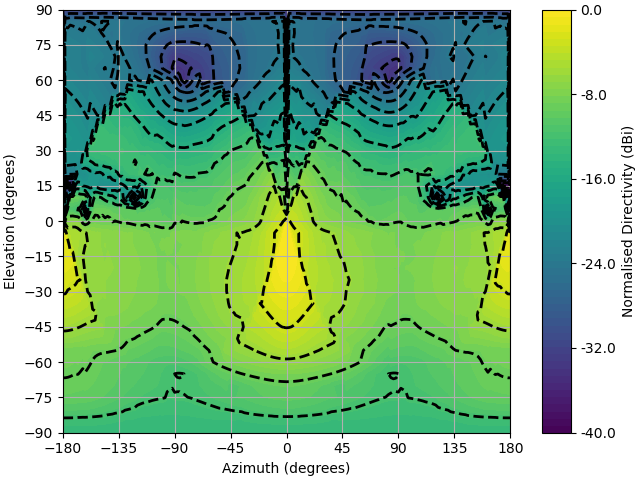

.. DO NOT EDIT.
.. THIS FILE WAS AUTOMATICALLY GENERATED BY SPHINX-GALLERY.
.. TO MAKE CHANGES, EDIT THE SOURCE PYTHON FILE:
.. "auto_examples\05_array_beamforming.py"
.. LINE NUMBERS ARE GIVEN BELOW.

.. only:: html

    .. note::
        :class: sphx-glr-download-link-note

        Click :ref:`here <sphx_glr_download_auto_examples_05_array_beamforming.py>`
        to download the full example code

.. rst-class:: sphx-glr-example-title

.. _sphx_glr_auto_examples_05_array_beamforming.py:

Array Beamforming
======================================================

This example uses the frequency domain :func:`lyceanem.models.frequency_domain.calculate_farfield` function to predict
the farfield patterns for a linearly polarised aperture with multiple elements. This is then beamformed to all farfield points using multiple open loop beamforming algorithms to attemp to 'map' out the acheivable beamforming for the antenna array using :func:`lyceanem.electromagnetics.beamforming.MaximumDirectivityMap`.

The Steering Efficiency can then be evaluated using :func:`lyceanem.electromagnetics.beamforming.Steering_Efficiency` for the resultant achieved beamforming.

.. GENERATED FROM PYTHON SOURCE LINES 14-18

.. code-block:: default

    import numpy as np
    import open3d as o3d
    import copy

.. GENERATED FROM PYTHON SOURCE LINES 19-28

Setting Farfield Resolution and Wavelength
-------------------------------------------
LyceanEM uses Elevation and Azimuth to record spherical coordinates, ranging from -180 to 180 degrees in azimuth,
and from -90 to 90 degrees in elevation. In order to launch the aperture projection function, the resolution in
both azimuth and elevation is requried.
In order to ensure a fast example, 37 points have been used here for both, giving a total of 1369 farfield points.

The wavelength of interest is also an important variable for antenna array analysis, so we set it now for 10GHz,
an X band aperture.

.. GENERATED FROM PYTHON SOURCE LINES 28-33

.. code-block:: default

    az_res = 181
    elev_res = 37
    wavelength = 3e8 / 10e9

.. GENERATED FROM PYTHON SOURCE LINES 34-38

Geometries
------------------------
In order to make things easy to start, an example geometry has been included within LyceanEM for a UAV, and the
:class:`open3d.geometry.TriangleMesh` structures can be accessed by importing the data subpackage

.. GENERATED FROM PYTHON SOURCE LINES 38-42

.. code-block:: default

    import lyceanem.tests.reflectordata as data

    body, array, source_coords = data.exampleUAV(10e9)

.. GENERATED FROM PYTHON SOURCE LINES 43-47

Visualise the Resultant UAV and Array
---------------------------------------
:func:`open3d.visualization.draw_geometries` can be used to visualise the open3d data
structures :class:`open3d.geometry.PointCloud` and :class:`open3d.geometry.PointCloud`

.. GENERATED FROM PYTHON SOURCE LINES 47-53

.. code-block:: default

    mesh_frame = o3d.geometry.TriangleMesh.create_coordinate_frame(
        size=0.5, origin=[0, 0, 0]
    )
    o3d.visualization.draw_geometries([body, array, source_coords, mesh_frame])

.. GENERATED FROM PYTHON SOURCE LINES 54-55

.. image:: ../_static/UAVArraywithPoints.png

.. GENERATED FROM PYTHON SOURCE LINES 55-61

.. code-block:: default

    from lyceanem.base_classes import structures

    blockers = structures([body, array])

.. GENERATED FROM PYTHON SOURCE LINES 62-69

Model Farfield Array Patterns
-------------------------------
The same function is used to predict the farfield pattern of each element in the array, but the variable 'elements'
is set as True, instructing the function to return the antenna patterns as 3D arrays arranged with axes element,
elevation points, and azimuth points. These can then be beamformed using the desired beamforming algorithm. LyceanEM
currently includes two open loop algorithms for phase weights :func:`lyceanem.electromagnetics.beamforming.EGCWeights`,
and :func:`lyceanem.electromagnetics.beamforming.WavefrontWeights`

.. GENERATED FROM PYTHON SOURCE LINES 69-103

.. code-block:: default

    from lyceanem.models.frequency_domain import calculate_farfield

    desired_E_axis = np.zeros((1, 3), dtype=np.float32)
    desired_E_axis[0, 2] = 1.0

    Etheta, Ephi = calculate_farfield(
        source_coords,
        blockers,
        desired_E_axis,
        az_range=np.linspace(-180, 180, az_res),
        el_range=np.linspace(-90, 90, elev_res),
        wavelength=wavelength,
        farfield_distance=20,
        elements=True,
        project_vectors=True,
    )

    from lyceanem.electromagnetics.beamforming import MaximumDirectivityMap

    az_range = np.linspace(-180, 180, az_res)
    el_range = np.linspace(-90, 90, elev_res)
    directivity_map = MaximumDirectivityMap(
        Etheta, Ephi, source_coords, wavelength, az_range, el_range
    )

    from lyceanem.electromagnetics.beamforming import PatternPlot

    az_mesh, elev_mesh = np.meshgrid(az_range, el_range)

    PatternPlot(
        directivity_map[:, :, 2], az_mesh, elev_mesh, logtype="power", plottype="Contour"
    )

.. image-sg:: /auto_examples/images/sphx_glr_05_array_beamforming_001.png
   :alt: 05 array beamforming
   :srcset: /auto_examples/images/sphx_glr_05_array_beamforming_001.png
   :class: sphx-glr-single-img

.. rst-class:: sphx-glr-script-out

 .. code-block:: none

    C:\Users\lycea\anaconda3\envs\cusignal-dev\lib\site-packages\numba\cuda\cudadrv\devicearray.py:885: NumbaPerformanceWarning: Host array used in CUDA kernel will incur copy overhead to/from device.
      warn(NumbaPerformanceWarning(msg))
    C:\Users\lycea\PycharmProjects\LyceanEM-Python\lyceanem\electromagnetics\beamforming.py:1167: RuntimeWarning: divide by zero encountered in log10
      logdata = 10 * np.log10(data)

.. GENERATED FROM PYTHON SOURCE LINES 104-105

.. GENERATED FROM PYTHON SOURCE LINES 105-125

.. code-block:: default

    from lyceanem.electromagnetics.beamforming import Steering_Efficiency

    setheta, sephi, setot = Steering_Efficiency(
        directivity_map[:, :, 0],
        directivity_map[:, :, 1],
        directivity_map[:, :, 2],
        np.radians(np.diff(el_range)[0]),
        np.radians(np.diff(az_range)[0]),
        4 * np.pi,
    )

    print("Steering Effciency of {:3.1f}%".format(setot))

    print(
        "Maximum Directivity of {:3.1f} dBi".format(
            np.max(10 * np.log10(directivity_map[:, :, 2]))
        )
    )

.. rst-class:: sphx-glr-script-out

 .. code-block:: none

    Steering Effciency of 9.1%
    C:\Users\lycea\PycharmProjects\LyceanEM-Python\docs\examples\05_array_beamforming.py:122: RuntimeWarning: divide by zero encountered in log10
      np.max(10 * np.log10(directivity_map[:, :, 2]))
    Maximum Directivity of 23.0 dBi

.. rst-class:: sphx-glr-timing

   **Total running time of the script:** ( 2 minutes  30.337 seconds)

.. _sphx_glr_download_auto_examples_05_array_beamforming.py:

.. only:: html

  .. container:: sphx-glr-footer sphx-glr-footer-example

    .. container:: sphx-glr-download sphx-glr-download-python

      :download:`Download Python source code: 05_array_beamforming.py <05_array_beamforming.py>`

    .. container:: sphx-glr-download sphx-glr-download-jupyter

      :download:`Download Jupyter notebook: 05_array_beamforming.ipynb <05_array_beamforming.ipynb>`

.. only:: html

 .. rst-class:: sphx-glr-signature

    `Gallery generated by Sphinx-Gallery <https://sphinx-gallery.github.io>`_
