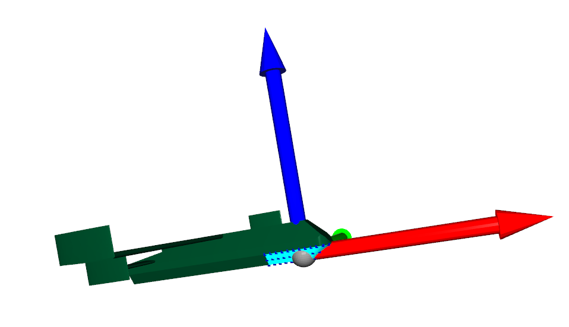
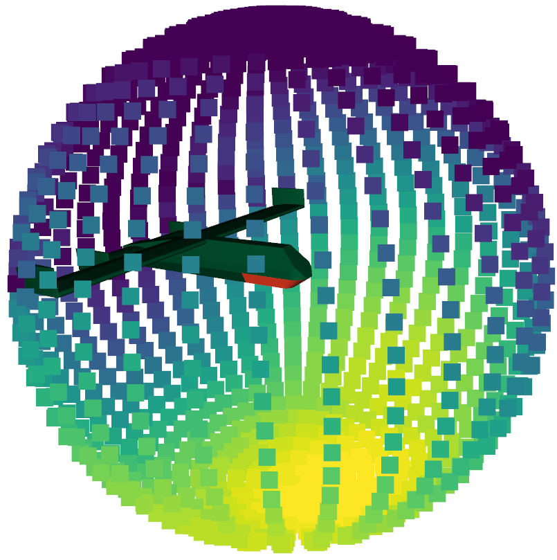
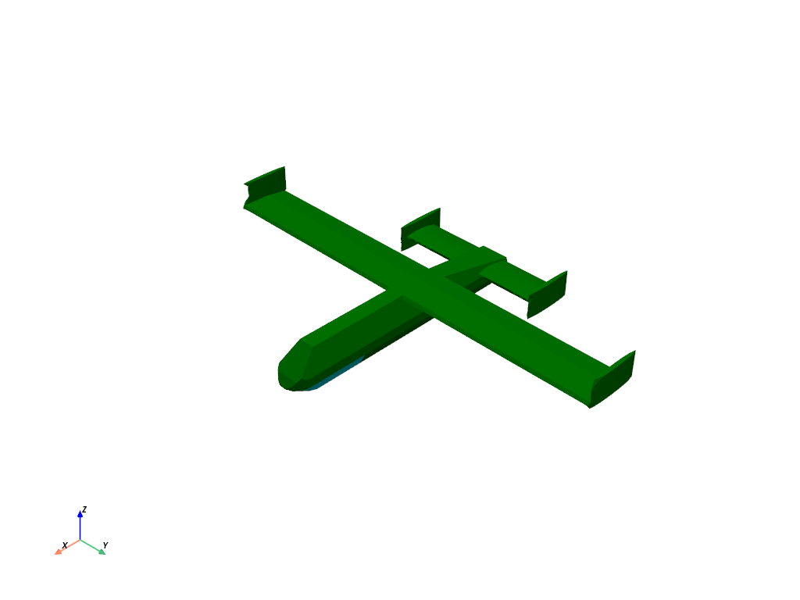

# Summary

The design of antenna arrays to meet complex requirements in sensors and communications depends upon access to 
robust tools to access and prototype potential antenna arrays on their intended structures without the need for 
in depth antenna design. Together with the simulation of wider communications and imaging problems, there is a pressing need for efficient 
electromagnetics tools capable of scaling from individual antennas to ultra large scale antenna arrays with 1000s of 
individual elements. 

# Statement of need

`LyceanEM`  is a Python library for modelling electromagnetic propagation for sensors and communications. 
`Frequency Domain` and `Time Domain` models are included that allow the user to model a wide array of complex 
problems from antenna array architecture and assess beamforming algorithm performance to channel modelling. 
The model is built upon a ray tracing approach, allowing for efficient modelling of large, low density spaces.

`LyceanEM` relies upon the `Numba` package to provide `CUDA` acceleration of electromagnetics, calculating 
antenna and antenna array patterns, scattering and aperture projections. This has been used in a number of scientific 
publications [@Pelham:2022;@Pelhama:2021;@Pelhamb:2021] and has been used in a tutorial on Antenna Array Design for Complex 
Platforms at Radar 2022. This capability in an open source package enables exciting research by academics and professional engineers alike. 

`LyceanEM` is also being used for ongoing multidisciplinary research combining channel modelling and spatial mapping using
computer vision. The flexible and efficient nature of the scattering model allows for exciting exploration of the signal 
sources in the local environment on low power computing devices.  

# Usage Examples

While some usage examples are presented here, many more are included in the documentation for `LyceanEM`, which can be found at [https://lyceanem-python.readthedocs.io/en/latest/](https://lyceanem-python.readthedocs.io/en/latest/). 

## Virtual Prototyping and Antenna Array Beamforming Research

The initial intended use case for `LyceanEM` was virtual prototyping for antenna arrays and apertures for sensors and 
communications. As show in \autoref{fig:uav1} & \autoref{fig:uav2}. This allows for antenna array patterns to be 
predicted extremely quickly compared to the time required for antenna design, and simulation on the platform of interest. 
This enables research into novel conformal antenna array configurations, and modelling of the performance of radar antenna 
arrays for autonomous vehicles research. This is the only package offering this capability from such a limited information set. 
This process allows the researcher or engineer to assess the maximum achievable beamforming envelope for the aperture 
( \autoref{fig:uavap}), then predict the antenna array pattern with functions supporting beamsteering to points of 
interest to generate an accurate prediction of the beamformed coverage (\autoref{fig:uavem}). This has been 
demonstrated in published research for both antenna arrays [@Pelhama:2021], and for reflector antennas [@Pelham:2022]. 
The antenna array simulation allows the researcher to define the array with any combination of polarisation and excitation 
functions, providing a powerful tool for antenna array research.

{ width=50% }

{ width=50% }

{ width=50% }

{ width=50% }

In addition to modelling of antenna arrays with conventional polarisation and propagation modes, `LyceanEM` supports the 
modelling and analysis of novel propagation models such as Orbital Angular Momentum states [@Allen:2019] for communications links, and allowed the prediction of the supportable OAM modes of an aperture, and the fourier analysis of the modal spectrum produced both by `LyceanEM` and the measured antenna patterns. 

## Frequency & Time Domain Channel Modelling

`LyceanEM` can also be used as a more general electromagnetic model, allowing the definition and simulation of complex 
channel models. In a published example, the Frequency domain model predicted the scattering parameters produced when 
illuminating a rotating metal plate with a horn antenna with a root mean square (RMS) error of -69dB between the predicted scattering parameters and the measured data. [@Pelhamb:2021]. 
This setup is show in \autoref{fig:scatter1} with the scattering plate at an angle of 45 degrees, and the 
transmitting and receiving horn antennas shown.

{ width=50% }

The resultant scattering with variation of normalised scattering angle (0 degrees when plate is 45 degrees offset from both transmitter and receiver), shows the comparison between the measured scattering at 26GHz, and that predicted by `LyceanEM` in \autoref{fig:scatter2}.

{ width=50% }

The Time domain model also produces comparable results, as shown in \autoref{fig:scatter3}, comparing the fast fourier transform of the time domain response (labelled 24GHz), and the frequency domain response (labelled FD) with the measurement.

{ width=50% }

## Generation of Training Datasets for Machine Learning

In addition to the initial uses, `LyceanEM` allows the uses to generate datasets for use in Machine Learning. This is of specific interest for channel models from spatial mapping by computer vision, allowing `LyceanEM` to predict the scattering characteristics of the local environment from computer vision or LIDAR based spatial mapping. This allows the creation of Generative Adversarial Networks for spatial multiplexing.

# References