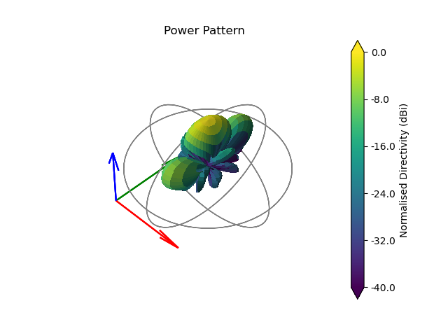

# Summary

The design of antenna arrays to meet complex requirements in sensors and communications depends upon access to 
robust tools to access and prototype potential antenna arrays on their intended structures without the need for 
in depth antenna design. Together with the simulation of wider communications and imaging problems requires efficient 
electromagnetics tools capable of scaling from individual antennas to ultra large scale antenna arrays with 1000s of 
individual elements. 

# Statement of need

`LyceanEM`  is a Python library for modelling electromagnetic propagation for sensors and communications. 
`Frequency Domain` and `Time Domain` models are included that allow the user to model a wide array of complex 
problems from antenna array architecture and assess beamforming algorithm performance to channel modelling. 
The model is built upon a ray tracing approach, allowing for efficient modelling of large, low density spaces.

`LyceanEM` relies upon the `Numba` package to provide `CUDA` acceleration of electromagnetics, calculating 
antenna and antenna array patterns, scattering and aperture projections. Thi has been used in a number of scientific 
publications [@Pelham:2022], [@Pelhama:2021], [@Pelhamb:2021] and has been used in a tutorial on Antenna Array Design for Complex 
Platforms at Radar 2022. This capability in an open source package enables exciting research by academics and professional engineers alike. 

`LyceanEM` is also being used for ongoing multidisciplinary research combining channel modelling and spatial mapping using
computer vision. The flexible and efficient nature of the scattering model allows for exciting exploration of the signal 
sources in the local environment on low power computing devices.  

# Usage Examples

# References